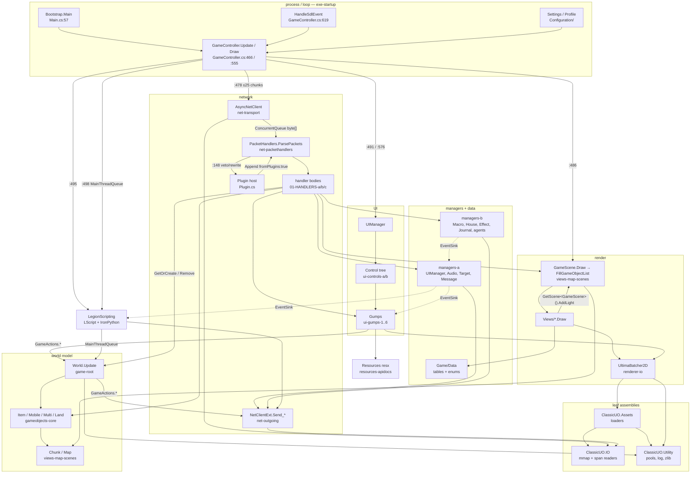

# 00 — INDEX: TazUO Holiday Edition as a running system

Branch `legacy`, `net472`, x64. All paths relative to `/home/user/TazUO-Holiday-Edition/`.
Unqualified `.cs` names under `src/ClassicUO.Client/`.

This is the single document that describes the client as a machine: what one tick does, how a
byte becomes a pixel, who owns which object, where the client invents state the server owns,
and where the sharp edges are. Per-area detail lives in the 25 partition maps indexed in §5.

---

## 1. The frame

### 1.1 Process → loop

```
Bootstrap.Main                       Main.cs:57      [STAThread]
  Language.Load()                    Main.cs:60      (before Log.Start at :65)
  ReadSettingsFromArgs(args) #1      Main.cs:113     (discarded at :137)
  ConfigurationResolver.Load<Settings>  Main.cs:137
  ReadSettingsFromArgs(args) #2      Main.cs:153     (this one survives)
  SetDllDirectory(<exe>/x64)         Main.cs:164
  Client.Run()                       Main.cs:279  → Client.cs:58
    Client.Load()                    Client.cs:99    UOFileManager.Load, StaticFilters, BuffTable,
                                                     ChairTable, UltimaLive.Enable, PacketsTable,
                                                     EncryptionHelper
    new GameController()             Client.cs:66    (inside `using` — Client.Game dangles after Run)
    Plugin.Create per plugin         Client.cs:80
    UoAssist.Start()                 Client.cs:85
    Game.Run()                       FNA
```

FNA lifecycle: ctor `GameController.cs:79` → `Initialize` `:118` (installs `SDL_SetEventFilter` `:131`)
→ `LoadContent` `:149` (hue samplers, fonts, renderer facades, `loadResourceAssets.Wait(10000)` `:230`,
`SetScene(new LoginScene())` `:231`).

### 1.2 One tick — `GameController.Update(gameTime)` (GameController.cs:466), in order

| # | Call | Anchor | Notes |
|---|---|---|---|
| 1 | `Time.Ticks` / `Time.Delta` ← gameTime | GameController.cs:470-471 | the only writer of the frame clock |
| 2 | `Mouse.Update()` | :474 | also called from the SDL filter (:781,:794,:843,:950) |
| 3 | **`ProcessNetworkPackets()`** | :478 → :138 | ≤ `MAX_PACKETS_PER_FRAME = 25` **chunks** (:136,:141) |
| 4 | `Plugin.Tick()` | :481 | |
| 5 | **`Scene.Update()`** | :486 | only when `drawScene` |
| 6 | `UIManager.Update()` | :491 | walks `UIManager.Gumps` LinkedList |
| 7 | `LegionScripting.OnUpdate()` | :495 | exactly one LScript statement per script per frame |
| 8 | `MainThreadQueue.ProcessQueue()` | :498 | python threads' marshalled work lands here — **after** LScript |
| 9 | `UIManager.SlowUpdate()` | :500-504 | every **500 ms** (`_nextSlowUpdate`) |
| 10 | FPS counter | :509 | 1000 ms window; writes `CUOEnviroment.CurrentRefreshRate` |
| 11 | frame pacing | :517-538 | `_intervalFixedUpdate[0]=frameDelay`, `[1]=217 ms` when `!IsActive && ReduceFPSWhenInactive`; under budget → `_suppressedDraw = true; SuppressDraw(); Thread.Sleep(1)` |
| 12 | `GameCursor.Update()` | :541 | |
| 13 | `Audio.Update()` | :542 | MP3 decode happens here (`UOMusic.OnBufferNeeded`, Audio/UOMusic.cs:128) |
| 14 | `DiscordManager.Update()` | :544 | |

Pacing constants: `IsFixedTimeStep = false`, `TargetElapsedTime = 1000/250 = 4 ms`,
`InactiveSleepTime = 0` (GameController.cs:97-99). `SetRefreshRate` (:320) clamps to
`Constants.MIN_FPS..MAX_FPS`; at MIN_FPS the frame budget is **80 ms** (:335).
`FrameDelay[1] = frameDelay >> 1` is read by movement interpolation (Mobile.cs:793).

### 1.3 `GameScene.Update` (GameScene.cs:873…) — the world tick

```
SelectedObject.TranslatedMousePositionByViewport = Camera.MouseToWorldPosition()   :873
World.Map.ClearUnusedBlocks()      :877-881   first at +5000 ms, then every 500 ms
                                              ≤50 chunks/call, LastAccessTime < Ticks-3000  (Map.cs:269-295)
PacketHandlers.SendMegaClilocRequests()   :883   drains _clilocRequests 15 serials/packet
ping                               :899-903  every 1000 ms
ForceResyncOnHang → Send_Resync    :905-911  no pong for 5000 ms and ≥5000 ms since last resync
World.Update()                     :913      ← THE WORLD SWEEP, see 1.4
HouseDiagnostics.LogHouseContents()       :914   (≤1/s)
_animatedStaticsManager.Process()  :915
BoatMovingManager.Update()         :916
Pathfinder.ProcessAutoWalk()       :917
DelayedObjectClickManager.Update() :918
_useItemQueue.Update()             :930      one serial per GlobalActionCooldown
AutoLootManager.Instance.Update()  :932      one item per MoveMultiObjectDelay ms
_moveItemQueue.ProcessQueue()      :933      one request per GlobalActionCooldown
GridHighlightData.ProcessQueue()   :934      ≤3 serials/frame
movement flags mouse→controller→kbd  :936-949
follow mode                        :951-975  re-pathfinds every frame while active
Macros.Update()                    :977
profile autosave                   :979-983  every 3,600,000 ms
multi-placement preview rebuild    :997-1055 every frame while CursorTarget.MultiPlacement
house-paint throttle 50 ms / pick-up-on-hold 1000 ms   :1082 / :1087
```

### 1.4 `World.Update()` (World.cs) — entity sweep and cull

```
deferred ObjectToRemove consumed                         :294   single slot, written by GameActions.PickUp
foreach World.Mobiles.Values → mob.Update()              :350-394
  _toRemove drain: TryGetValue-by-key, Remove, ReturnToPool  :396-412
foreach World.Items.Values → item.Update()               :424-459
  _toRemove drain: same discipline                       :461-477
_effectManager.Update()                                  :479
WorldTextManager.Update()                                :480
WMapManager.RemoveUnupdatedWEntity()                     :481   self-throttled to 1000 ms
```

**The cull sits inside the sweep, gated at 20 Hz**: `_timeToDelete = Time.Ticks + 50`
(World.cs:334-338). Condemnation radius is `ClientViewRange + item.MultiDistanceBonus`
(World.cs:436), and `KeptByItsHouse` (World.cs:275-288) exempts anything inside a
client-remembered house footprint entirely. Entity `Update()` runs **every** frame regardless
of the 50 ms gate.

### 1.5 `Draw` (GameController.cs:555)

```
Profiler.EndFrame/BeginFrame              :557-558
GraphicsDevice.Clear(black)
tiled background, bgHueShader             :566
Scene.Draw(_uoSpriteBatch)                :571   → GameScene.Draw
UIManager.Draw(_uoSpriteBatch)            :576
SelectedObject.HealthbarObject = null
SelectedObject.SelectedContainer = null   :580-581
GameCursor.Draw                           :584
Plugin.ProcessDrawCmdList
```

`GameScene.Draw` — **the cull, the sort and the hit-test all live here, not in Update**:

```
direct path:   PrepareLightsRendering  :1202   ← drains the buffer the PREVIOUS frame filled
               DrawWorld               :1205
render-target: DrawWorld then PrepareLightsRendering  :1244-1246 / :1254-1256

DrawWorld:
  SelectedObject.Object = null                        GameScene.cs:1285
  FillGameObjectList()                                :1286
    reset 4 render lists (statics / animations / effects / transparents)
    _alphaChanged = _alphaTimer < Ticks; re-arm +20 ms (ALPHA_TIME)   :735-740
    FoliageIndex++ wrapping 100→1                     :742-747
    GetViewPort() → UpdateMaxDrawZ()                  (early-outs on unchanged player X/Y/Z,
                                                       GameSceneDrawingSorting.cs:106-111)
    two diagonal sweeps [_minTile.._maxTile] → AddTileToRenderList   :790-828
       walks each chunk cell's TPrevious/TNext intrusive list        GameSceneDrawingSorting.cs:732
       ProcessAlpha, CheckIfBehindATree, circle-of-transparency
       PushToRenderList → GameObject.CheckMouseSelection()           :665,:672  ← MOUSE PICK
    foliage alpha pass                                :830-845
    UpdateTextServerEntities over ALL mobiles then ALL items         :847-848
  DrawRenderList ×4: statics, animations, effects, transparents(DepthRead)  :1301-1325
    → GameObject.Draw(batcher, RealScreenPosition.X/Y, depth)        :1382-1402
  multi preview :1350, weather :1362
  death screen short-circuits everything while DeathScreenTimer > Ticks  :1114,:1667
```

Batcher: `UltimaBatcher2D.Begin` → N `Draw*` → `Flush` per contiguous texture run
(`Batcher2D.cs:1347-1360`) in batches of `MAX_SPRITES = 0x800`; `Flush` is also forced mid-frame
by `ClipBegin/ClipEnd/SetBlendState/SetStencil/SetSampler`.

### 1.6 Off the frame thread

| Thread | What | Anchor |
|---|---|---|
| socket receive (`Task.Run`) | read ≤4096 B, decrypt, Huffman-decompress, enqueue | AsyncNetClient.cs:52,:91,:338 |
| network send (`Task.Run`) | drain `_sendStream` 4096 B/iteration, `Statistics.Update()` | AsyncNetClient.cs:307,:412 |
| SDL event filter | `HandleSdlEvent` — runs at pump time, not at a defined point in Update | GameController.cs:619 |
| python script threads | one OS `Thread` per script, block on `MainThreadQueue.InvokeOnMainThread` | LegionScripting.cs:444 |
| `MobileStatusRequestQueue` | one status request per 1000 ms | MobileStatusRequestQueue.cs:35 |
| `WorldMapGump.Load()` | full map raster + `SetDataPointerEXT` | WorldMapGump.cs:1476 |
| `ExternalImageLoader.LoadResourceAssets` | `Texture2D.FromStream`/`SetData` | ExternalImageLoader.cs:313 |
| `ULMapLoader.AsyncWriterTasked` | 10 ms poll, writes `.mul` blocks | UltimaLive.cs:1149,:1172 |
| various `Task.Run` | CoolDownBarManager message handler, SpellVisualRangeManager cast detection, PersistentVars save, GitHub script fetch, AnonMetrics POST | CoolDownBarManager.cs:20, SpellVisualRangeManager.cs:70, PersistentVars.cs:221, ScriptBrowser.cs:454, AnonMetrics.cs:24 |

---

## 2. The packet path

One byte on the wire → one changed pixel. Every hop named.

```
 1. TCP recv                    AsyncSocketWrapper.ReceiveLoopAsync   AsyncNetClient.cs:91   [pool thread]
      reads only min(4096, _socket.Client.Available)                  AsyncNetClient.cs:99-102
      copies into a fresh byte[bytesRead]                             AsyncNetClient.cs:114
      await Task.Delay(1) per iteration                               AsyncNetClient.cs:119
 2. OnDataReceived                                                    AsyncNetClient.cs:338   [pool thread]
      Statistics.TotalBytesReceived +=                                AsyncNetClient.cs:342
 3. ProcessEncryption(span)                                           AsyncNetClient.cs:345 → :404
      gated on _isCompressionEnabled                                  AsyncNetClient.cs:406
      EncryptionHelper.Decrypt — NO-OP unless TWOFISH_MD5             Encryption.cs:194-200
 4. DecompressBuffer(span)                                            AsyncNetClient.cs:346 → :446
      Huffman.Decompress into shared _uncompressedBuffer[0x10000]     Huffman.cs:310, AsyncNetClient.cs:186
      decoder state (_bitNum/_value/_mask/_treePos) spans TCP reads   Huffman.cs:299-300
 5. decompressed.ToArray(); _incomingMessages.Enqueue(message)        AsyncNetClient.cs:350-351
      ==== ONLY THREAD BOUNDARY IN THE RECEIVE PATH ====              ConcurrentQueue<byte[]>  :192
 6. GameController.ProcessNetworkPackets()                            GameController.cs:138   [FRAME THREAD]
      TryDequeuePacket, ≤25 chunks                                    GameController.cs:141, :360
 7. PacketHandlers.ParsePackets(Span)                                 PacketHandlers.cs:91
      Append(data,false) → CircularBuffer _buffer                     PacketHandlers.cs:93,:165,:88
      ParsePackets(_buffer,true) + ParsePackets(_pluginsBuffer,false) PacketHandlers.cs:95
 8. framing, under lock(stream)                                       PacketHandlers.cs:98-158
      GetPacketInfo → PacketsTable.GetPacketLength(buffer[0])         PacketHandlers.cs:197,:214 / PacketsTable.cs:298
        -1 ⇒ u16BE at bytes 1-2 (header-inclusive), packetOffset = 3  PacketHandlers.cs:217-229
        short stream ⇒ break, bytes stay buffered                     PacketHandlers.cs:125-133
      grow _readingBuffer by doubling                                 PacketHandlers.cs:135-138
      stream.Dequeue(packetBuffer, 0, packetlength)                   PacketHandlers.cs:140
 9. PacketLogger.Default?.Log(msg,false)                              PacketHandlers.cs:142
    HouseDiagnostics.LogPacket(msg,false)                             PacketHandlers.cs:143
10. Plugin.ProcessRecvPacket(packetBuffer, ref packetlength)          PacketHandlers.cs:148 → Plugin.cs:532
      returning false DROPS the packet; ref length may rewrite it     Plugin.cs:540-548
11. AnalyzePacket → new StackDataReader(data); Seek(offset);
      _handlers[data[0]](ref reader)                                  PacketHandlers.cs:181-195
      119 registered ids + 2 conditional (0x3F/0x40, UltimaLive)      01-PROTOCOL.md §1
```

Worked example — an item appears on the ground (`0x1A UpdateItem`):

```
12. UpdateItem handler                                                PacketHandlers.cs:869
      flag-driven field layout, bits on serial/graphic/x/y            PacketHandlers.cs:876-953
13. UpdateGameObject(...)                                             PacketHandlers.cs:6545
      World.GetOrCreateItem(serial)                                   World.cs:558
        destroyed entry under this serial → Remove + ReturnToPool     World.cs:565-569
        Item.Create → QueuedPool<Item>.GetOne()                       Item.cs:52,:255
        World.Items.Add                                               World.cs:577
      item.X/Y/Z                                                      PacketHandlers.cs:6672-6674
      Hue via FixHue (>=0x0BB8 collapses to 1)                        PacketHandlers.cs:6682 / Entity.cs:121-134
      Amount, Flags, Direction (setter fires OnDirectionChanged)      PacketHandlers.cs:6689-6691
      CheckGraphicChange → corpse anim / LoadMulti                    PacketHandlers.cs:6692 / Item.cs:607,:642
14. item.SetInWorldTile(x,y,z)  (on-ground only)                      PacketHandlers.cs:6798-6800
      GameObject.AddToTile                                            GameObject.cs:171-184
      Map.GetChunk(x,y,load:true) — may build a whole 8×8 block       Map.cs:71-101
      Chunk.AddGameObject: priority-sorted insert into TPrevious/TNext
        writes TileChunk/TileCellX/TileCellY                          Chunk.cs:178-180
        PriorityZ                                                     Chunk.cs:283
        Tiles[x%8, y%8]                                               Chunk.cs:289
15. EventSink.InvokeOnItemCreated / gump RequestUpdateContents        PacketHandlers.cs:6695, :6574-6582
--- same frame, GameController.Draw ---
16. FillGameObjectList → AddTileToRenderList walks the cell list      GameSceneDrawingSorting.cs:732
      UpdateRealScreenPosition                                        GameSceneDrawingSorting.cs:734
      ProcessAlpha / foliage / circle-of-transparency
      PushToRenderList (also runs CheckMouseSelection)                GameSceneDrawingSorting.cs:665,:672
17. DrawRenderList → GameObject.Draw(batcher, sx, sy, depth)          GameScene.cs:1382-1402
18. Item.Draw → View.DrawStatic → batcher.Draw                        ItemView.cs / View.cs:145
      ArtLoader.GetArt on cache miss: file decode + PixelPicker.Set
      + Texture2D.SetDataPointerEXT, synchronously                    Arts/Art.cs:45, ArtLoader.cs:370
19. UltimaBatcher2D.Flush → GraphicsDevice.DrawIndexedPrimitives      Batcher2D.cs:1347-1360
```

Two asymmetries worth carrying: handlers run **before** `Scene.Update` in the same frame
(GameController.cs:478 vs :486), so world mutations are visible to the scene and to the draw
that follows. And the packet log is written **before** the inbound plugin hook but **after**
the outbound one (PacketHandlers.cs:142 vs :148; AsyncNetClient.cs:387 vs :379) — a
plugin-swallowed inbound packet is logged, a swallowed outbound one is not.

Outbound is the mirror: `Send_*` extension (OutgoingPackets.cs) → `StackDataWriter` →
`AsyncNetClient.Send` (AsyncNetClient.cs:372) → `Plugin.ProcessSendPacket` (:379) →
`PacketLogger` (:387) → `EncryptionHelper.Encrypt` **in place over the caller's span** (:392) →
`lock(_sendStream)` enqueue (:395) → `NetworkLoopAsync`/`ProcessSendAsync` on the pool thread
(:307,:412) drains 4096 B per ~1 ms iteration.

---

## 3. Object lifetime

*Deep dive: `03-LIFETIME.md` — every creation site, every destroy site, the four distinct
windows in which a dictionary key can point at an object whose serial has changed, the fields
that survive pool reuse, and a per-packet-id table of what each id creates and destroys.*

### 3.1 Pools

All `QueuedPool<T>` (Utility/QueuedPool.cs:38). **The lambda is the reset-on-handout hook, not
on-return** (QueuedPool.cs:74) — an object sits in the pool carrying its last owner's fields.

| Pool | Anchor | Capacity | Returned from |
|---|---|---|---|
| `Item._pool` | Item.cs:52 | `PREDICTABLE_CHUNKS * 3` | `ReturnToPool` only (Item.cs:296-333), guarded by `_inPool` :333 |
| `Mobile._pool` | Mobile.cs:48 | `PREDICTABLE_CHUNKS` | `ReturnToPool` only (Mobile.cs:1146-1160), `_inPool` :1160 |
| `Multi._pool` | Multi.cs:43 | `PREDICTABLE_MULTIS` | **inside `Destroy()`** Multi.cs:118 |
| `Static._pool` | Static.cs:42 | `PREDICTABLE_STATICS` | **inside `Destroy()`** Static.cs:116 |
| `Land._pool` | Land.cs:45 | `PREDICTABLE_TILE_COUNT` | **inside `Destroy()`** Land.cs:86 |
| `Chunk._pool` | Chunk.cs:44 | 300 | `Chunk.Destroy()` :428 |
| `TextObject._queue` | TextObject.cs:44 | 1000 | `Destroy()` :104 |
| `RenderedText._pool` | RenderedText.cs:64 | 3000 | `Destroy()` :745 |
| `TextBox._pool` | Controls/TextBox.cs:49 | unbounded static `Queue` | `Dispose()` :467 |
| `ObjectPool<PathNode/PathObject/List<GameObject>>` | Pathfinder.cs:130,1114,1184 | `MaxCapacity` 3000 | `PriorityQueue`, `CleanupPathfinding` |

### 3.2 Creation

- Entities: `World.GetOrCreateItem` (World.cs:558) / `GetOrCreateMobile` (:583) from packet
  handlers. Both **evict a destroyed entry under the same serial and `ReturnToPool` it, then
  create a new one under that serial in the same call** (World.cs:565-569, :589-593).
- `PlayerMobile`: `World.CreatePlayer` on 0x1B EnterWorld (World.cs:194); a second 0x1B on a
  live session runs `World.Clear()` first (World.cs:189-191).
- `Land`/`Static`: `Chunk.Load` on first `Map.GetChunk` for a block (Map.cs:96-99).
- `Multi`: `Item.LoadMulti` (Item.cs:335-505) — synchronous file seek + `ZLib.Decompress` on the
  frame thread, one `Multi` per block, hundreds for a house.
- `Chunk`: `Map.GetChunk(load:true)`; can be created **during the render traversal**
  (`HasSurfaceOverhead` probes a 4×4 neighbourhood per mobile per frame,
  GameSceneDrawingSorting.cs:616-640).

### 3.3 Destruction

`GameObject.Destroy` (GameObject.cs:454-472) clears `Next/Previous/RenderListNext/_averageOverTime`,
calls `RemoveFromTile()`, clears `TextContainer`, sets `IsDestroyed`, and writes `Hue = 0` /
`Graphic = 0` **through the property setters** — so `GraphicsReplacement.Replace/ReplaceHue` and
the virtual `OnGraphicSet` run on an object mid-teardown.

`Entity.Destroy` (Entity.cs:202) **sends a network packet** (`GameActions.SendCloseStatus`) from
inside the per-frame world sweep.

`World.Get` returns `null` for a destroyed entity, but that entity **remains in
`World.Items`/`World.Mobiles`** until the next sweep (World.cs:551-554); `Items.Get`/`Contains`
still see it.

Holiday fork delta: `Item`/`Mobile` pooling was moved **out** of `Destroy()` into explicit
`ReturnToPool`, called only from the two `World.Update` drains and from `GetOrCreate*`
(World.cs:407, :472, :569, :593, :683, :716). `Multi`/`Static`/`Land` still pool from `Destroy()`.

### 3.4 Where identity can be reassigned

| Site | What happens |
|---|---|
| World.cs:341-349, :414-423 | in-source comment: a destroyed entity returns to the pool and can be handed out under a **different serial** before the sweep runs; the dictionary key and `entity.Serial` disagree. Both drains re-verify by key (`:402`, `:467`) before `Remove` + `ReturnToPool`. |
| PacketHandlers.cs:4025-4036 | `DisplayDeath` reassigns `owner.Serial = serial \| 0x80000000` and **re-keys `World.Mobiles`**. Every holder of the old serial (gumps, `TargetManager.LastAttack`, party, world-map pins) now points at a key that no longer exists. |
| Mobile.cs:698-718 | serials with bit 31 set are removed from `CorpseManager` + `World` from inside the sweep's own `foreach`. |
| PacketHandlers.cs:4830-4832 | spellbook pseudo-items are `Item.Create(cc)` with `cc` in **1..64** — real serial space. |
| RaceChangeGump.cs:502, CreateCharAppearanceGump.cs:1006 | fake hair/beard items at `0x4000_0000 + layer` inserted into the live `World.Items`; a fake `PlayerMobile(0)`/`(1)` into `World.Mobiles`. Removed only on confirm, not on right-click close. |
| Multi.cs:110-119, Static.cs:108-117, Land.cs:78-87 | pooled from `Destroy()`; a surviving reference (`House.Components`, a chunk cell list, `GameEffect.Source`) points at an object that may already be reissued. `GameEffect.cs:111-116` reads `Source.IsDestroyed`, which can read `false` again after reuse. |
| MacroButtonGump.cs:283 | `LocalSerial = macroIndex + 1000` assigned **at save time**, derived from position in `GetAllMacros()`. |
| RacialAbilityButton.cs:47 | `LocalSerial = 7000 + graphic`. |
| Gump.cs:139-144 | `Gump.Dispose` clears `Opened` on `World.Items.Get(LocalSerial)` — for gumps whose serial is not an item, this hits an unrelated item. |
| PaperdollGump.cs:919 | `EquipmentSlot.LocalSerial` is reassigned in `Update` to whatever item now occupies the layer. |

### 3.5 What holds references across frames

- Chunk cell lists (`TPrevious`/`TNext`) plus the `TileChunk`/`TileCellX`/`TileCellY` back-refs
  on every `GameObject` (GameObject.cs:192-197, Chunk.cs:178-180). `RemoveFromTile` hands the
  cell to `TNext ?? TPrevious` (GameObject.cs:226-231) and nothing revalidates that the chunk
  is still the one it was linked into.
- Render lists: `RenderListNext` chains, `_foliages[100]` raw `GameObject[]`
  (GameSceneDrawingSorting.cs:50,:377) read again after the whole traversal (GameScene.cs:832-844).
- `SelectedObject.Object / LastLeftDownObject / HealthbarObject / SelectedContainer /
  CorpseObject` (SelectedObject.cs:42-47) — written during traversal, nulled at three different
  points mid-frame (GameScene.cs:1285, :985-988, :1485-1488; GameController.cs:580-581).
- `ItemHold` — a **value snapshot** of graphic/hue/amount/layer/flags taken at pickup
  (ItemHold.cs:90-116); later server updates never refresh it.
- Gumps re-resolve by serial each frame (`ItemGump.cs:60,129,164`; `GridContainer.cs:80`) but are
  not disposed when the item dies; several cache the `Item` object itself
  (`ModernPaperdoll.ItemGumpFixed.item` :441, `GridLootGump._corpse` :68,
  `MultiItemMoveGump.MoveItems` static `ConcurrentQueue<Item>` :50).
- `Entity._hitsPercText` — one static `RenderedText[101]` shared by every entity in the world
  (Entity.cs:54); a `Destroy()` elsewhere returns that instance to the pool while the array still
  points at it.
- Persisted across sessions: `GridSlotManager.itemPositions` slot→serial (GridContainer.cs:1448
  + `GridContainerSaveData`), `DressConfig` items stored **by serial** (DressAgentManager.cs:435).
- Never pruned for the process lifetime: `HouseManager._footprints` (HouseManager.cs:68),
  `PlayerMobile.AutoOpenedCorpses`/`ManualOpenedCorpses` (PlayerMobile.cs:96-97),
  `WorldMapEntityManager._mobileNameCache` (WorldMapEntityManager.cs:46),
  `WorldMapGump.following` static `Mobile` (WorldMapGump.cs:90),
  `PixelPicker.m_Data` (PixelPicker.cs:10-11), `SolidColorTextureCache` (:41),
  `RegexHelper._regexes` (:8), `SystemChatControl._messageHistory` (:77).
- Python wrappers validate a cached entity only by `Serial` equality, never `IsDestroyed`
  (PyEntity.cs:68, PyItem.cs:35, PyMobile.cs:47); `PyGameObject` snapshots X/Y/Z/Graphic/Hue at
  construction and holds a raw `GameObject` ref forever (PyGameObject.cs:85-114).

---

## 4. Client state vs server authority

*Deep dive: `02-IGNORE-LIST.md` — the exhaustive enumeration, ~200 numbered entries across
eleven categories (packets ignored outright, whole-packet guard drops, fields parsed then
discarded, clamps and substitutions, distance culling, retention past the server's range,
step deferral, settings whose effect is to override the server, self-issued re-requests,
client-invented state, and interpolation at rates the server did not specify), each with
`file:line`, the triggering condition and the governing setting.*

Everywhere the client keeps, predicts, or invents state the server owns.

### 4.1 Position and movement

| State | Client side | Server side | On disagreement |
|---|---|---|---|
| `Mobile.Steps` (`Deque<Step>`, cap `MAX_STEP_COUNT = 5`) | Mobile.cs:150; drawn position is the **queue front**, server position is the **queue back** — they differ by up to 5 tiles (Mobile.cs:785-788) | packet 0x77/0x78/0x1A `EnqueueStep` | queue full ⇒ handler **snaps and clears** (PacketHandlers.cs:6718-6726). A step identical to the queued end is silently swallowed (Mobile.cs:313-316) — the server's position is dropped. Drain is accelerated by `stepTime /= Steps.Count`; there is no catch-up, only overflow. |
| `WalkerManager` seq/fastwalk/`StepInfos[5]` | WalkerManager.cs:96-106; `Send_WalkRequest` carries `WalkSequence` + `FastWalkStack.GetValue()` (PlayerMobile.cs:1837,:2015) | 0x21 DenyWalk / 0x22 ConfirmWalk | DenyWalk: `ClearSteps()`, `Reset()`, snap X/Y/Z (WalkerManager.cs:108-121). ConfirmWalk bad step: `ResendPacketResync = true`, `WalkingFailed = true`, counters zeroed, **`Send_Resync`** (WalkerManager.cs:167-183). |
| ping / hang | `_timePing` 1000 ms (GameScene.cs:899-903) | 0x73 pong | no pong for 5000 ms ⇒ `Send_Resync` (GameScene.cs:905-911, `ForceResyncOnHang`) |
| boat movement | `BoatMovingManager` interpolates the multi and every rider by `boat - offset` (BoatMovingManager.cs:239-394) | 0xF6 | deque trimmed to >5 from the front — queued steps silently discarded (:104) |

### 4.2 View range and object retention

- `World.ClientViewRange` is the server's answer but is initialised to `Constants.MAX_VIEW_RANGE`
  = 40 (World.cs:87) while the in-source comment describes 24 as the protocol maximum
  (World.cs:272-273). `LoginComplete` sets it from `Settings.GlobalSettings.ClientViewRange`
  clamped to MIN/MAX (PacketHandlers.cs:2468-2473), then the server's 0xC8 overwrites it (:2741).
  The two disagree for the frames in between.
- **`World.KeptByItsHouse`** (World.cs:275-288, gated on `Settings.KeepHouseContentsLoaded`) +
  `HouseManager._footprints` (HouseManager.cs:68-140): items inside a client-remembered house are
  exempt from the distance cull entirely, so the client keeps rendering contents the server has
  stopped refreshing until the house itself is released. `IsInsideKnownHouse` ignores the map
  index (HouseManager.cs:129-137), so a Trammel footprint spares objects at the same x/y on
  Felucca.
- `DeleteObject` (0x1D) is **refused** for the player's own serial (PacketHandlers.cs:1114) and
  **deferred with no bookkeeping** when `World.CorpseManager.Exists(0, serial)` (:1209-1212) —
  the entity stays in `World.Items`/`World.Mobiles`, undestroyed and unpooled.

### 4.3 Optimistic writes — client acts before the server confirms

| Write | Anchor |
|---|---|
| pickup removes the item from its tile and clears its `TextContainer` before the ack | GameActions.cs:874-879 |
| `World.ObjectToRemove` is a single slot consumed once per `World.Update`; two pickups in one frame lose the first | World.cs:69,:294 + GameActions.cs:879 |
| `World.Player.Abilities[]` mutated locally (mask `0x7F`, XOR `0x80`) around the send | GameActions.cs:1210-1251 |
| `TargetManager.LastAttack` set at request time | GameActions.cs:609 |
| `World.Player.HasGump = false` inside `Send_GumpResponse` | OutgoingPackets.cs:1352-1353 |
| `skill.Lock` assigned alongside `Send_SkillStatusChangeRequest` | StandardSkillsGump.cs:912-915, SkillGumpAdvanced.cs:685-701 |
| `World.Player.Skills[i].Lock` written **with no packet at all** from scripting | Commands.cs:484, API.cs:1823 |
| `World.Party.Leader = Inviter` on Accept click | PartyInviteGump.cs:96-97 |
| `MessageManager.PromptData` cleared client-side right after responding | Commands.cs:871,:892, API.cs:825 |
| `FloorVisionState[floor]` advanced and re-rendered before any server exchange | HouseCustomizationGump.cs:1927-1936 |
| `MoveItemQueue` issues `Send_PickUpRequest` then `DropItem`/`Send_EquipRequest` back-to-back in one frame with no ack | MoveItemQueue.cs:85-93 |
| script paths fire popup-request + popup-selection back-to-back with no wait for the menu | protocol-outgoing.md #70 |

### 4.4 Client-invented state written onto server objects

- `Item.X` / `Item.Y` overwritten by container-gump layout clamping (ContainerGump.cs:707-722).
- `TileDataLoader.Instance.StaticData[Graphic].SetImpassable(true/false)` — global tile data
  mutated **from inside `Item.Draw`**, keyed on the player's current stamina (ItemView.cs:91-105).
  `GameSceneDrawingSorting.cs:1003-1007` takes a `ref` into that same array during traversal.
- `TileMarkerManager.UpdateLiveTilesAt` writes `obj.Hue` directly on live `Land`/`Static` and on
  removal sets hue to **0**, not the original — the original is never saved
  (TileMarkerManager.cs:160-167).
- `GridHighlightData.ProcessQueue` writes `Item.MatchesHighlightData/HighlightHue/HighlightColor`
  (GridHighLightData.cs:172-174); nothing clears them when a rule stops matching.
- `PyEntity.SetHue` writes `e.Hue` on the live world entity (PyEntity.cs:62).
- `SpellVisualRangeManager` sets/clears `World.Player.Flags |= Flags.Frozen` from a `Task.Run`
  continuation, from three different places (SpellVisualRangeManager.cs:100, :110, :164, :601).
- `Entity.HitsPercentage` is recomputed locally every frame while the server also sends
  percentages into the same field (Entity.cs:189-195).
- `AnimatedStaticsManager` writes `ArtLoader.Instance.Entries[...].AnimOffset` in place from the
  frame loop (AnimatedStaticsManager.cs:131).
- `StatusGumpOutlands` displays `Luck`/`StatsCap`/resistances as hunger/murder-count/timers —
  client display and server meaning disagree by construction (StatusGump.cs:1956, :2058, marked
  `FIXME: packet handling`).
- `MapGump.AddPin` overwrites the server-supplied map origin with a `Width/300f` estimate
  (MapGump.cs:217-226).
- `World.Player.LastGumpID` — a single-slot client memory of the last server gump, keyed on by
  the whole scripting layer (Commands.cs:594,:606,:628; API.cs:1927,:1974).

### 4.5 Flag-bit races

`Mobile.Flags` is mutated with OR/AND-NOT by 0x16/0x17 `NewHealthbarUpdate` (PacketHandlers.cs:836-859)
and assigned **wholesale** by a following 0x77/0x78, which discards those bits. Poison is written
to one of two different fields depending on client version (`SetSAPoison` ≥ CV_7000 vs the
`Flags.Poisoned` bit); `Mobile.IsPoisoned` reads only the version-matching one (Mobile.cs:153-156).
`Flags.Poisoned` and `Flags.Flying` are both `0x04` (EntityFlags.cs:43-44).

### 4.6 Identity the client mints itself

The client writes synthetic serials into the same `World.Items`/`World.Mobiles` namespace the
server owns: spellbook pseudo-items at `cc` in 1..64 (PacketHandlers.cs:4830-4832), hair/beard
preview items at `0x4000_0000 + layer` (RaceChangeGump.cs:502, CreateCharAppearanceGump.cs:1006),
a fake `PlayerMobile(0)`/`(1)` during character creation (CreateCharAppearanceGump.cs:261),
`macroIndex + 1000` on `MacroButtonGump` (MacroButtonGump.cs:283) and `7000 + graphic` on
`RacialAbilityButton` (RacialAbilityButton.cs:47). `DisplayDeath` re-keys a live mobile under
`serial | 0x80000000` (PacketHandlers.cs:4025-4036) and `HealthBarGump` probes corpses as
`LocalSerial | 0x8000_0000` (HealthBarGump.cs:578, :1865).

### 4.7 Persisted client state keyed on server-owned identity

`GridSlotManager.itemPositions` (GridContainer.cs:1448) and `DressConfig` (DressAgentManager.cs:435)
persist **item serials** across sessions; the server reassigns serials freely.
`InfoBarManager.cs:234` casts a saved int straight to `InfoBarVars`, reinterpreted against
`InfoBarVarsOutlands` under Outlands where members diverge from index 8.
`ForcedTooltipManager.cs:21` compares an OPL *revision* against `Time.Ticks`, which only works
because that class writes `Time.Ticks + UPDATE_DELAY` as the revision.

---
## 5. Partition index

29 maps. Read them in the order given here if you are new to the client; jump straight to one if
you know what you are chasing.

### Process, loop, world

**`exe-startup.md`** — `src/ClassicUO.Client/*.cs` top level + `Configuration/` + `Input/`, 23 files,
6,350 lines. `Bootstrap.Main` and the double argv pass, `Client.Load`/`Client.Run`, the FNA
`GameController` (`Update` :466, `Draw` :555, `HandleSdlEvent` :619), frame pacing and
`MAX_PACKETS_PER_FRAME`, the two config stores (`settings.json` global, `profile.json` per
character), gump XML persistence with its `.bak1/2/3` rotation, and the static input singletons
(`Mouse`, `Keyboard`, `Controller`, `KeysTranslator`) everything else polls. Open this for tick
order, argv handling, and startup ordering constraints.

**`game-root.md`** — the 15 files directly under `Game/`, 7,895 lines. The `World` god-object and
its per-frame sweep + 20 Hz distance cull, `GameActions` (the whole player-intent surface),
`Pathfinder` (A* with pooled nodes, 150,000-node ceiling), `UltimaLive`, `GameCursor`/`ItemHold`,
`Weather`, `LinkedObject`, `SelectedObject`, `SerialHelper`, `Constants`, and the Win32
`UoAssist` IPC window. Open this for entity lifetime at the collection level and for "the player
did a thing" entry points.

**`gameobjects-core.md`** — `Game/GameObjects/*.cs`, 21 files, 10,135 lines. `GameObject`/`Entity`/
`Item`/`Mobile`/`PlayerMobile`/`Multi`/`Static`/`Land`/`House`, the effect hierarchy, overhead
text (`TextObject`, `TextContainer`, `OverheadDamage`), `RenderedText`, `LineOfSightHelper`. The
authority on pooling, `_inPool`, step playback (`Deque<Step>` capped at 5), animation, multi
loading, and the tile-cell back-references (`TileChunk`/`TileCellX`/`TileCellY`) this fork added.

**`views-map-scenes.md`** — `GameObjects/Views/` + `Game/Map/` + `Game/Scenes/`, 16 files,
10,197 lines. `Chunk`/`Map` (the 8×8 tile store and its intrusive per-cell lists),
`GameSceneDrawingSorting` (viewport, `UpdateMaxDrawZ`, alpha, foliage, circle-of-transparency,
`PushToRenderList`, and the mouse hit-test), the `Views/*.Draw` bodies, `GameScene` (per-frame
manager fan-out, lights, render targets, post-FX, death screen) and `LoginScene` (state machine,
relay, reconnect). Open this for anything about what appears on screen and in what order.

### Network

**`protocol-transport.md`** — narrative companion, 753 lines. Start here before touching
networking: which client class is live (`AsyncNetClient`, `NetClient` is a shim), a line-by-line
trace of a byte from `recv()` to handler, the definitive frame-thread-vs-network-thread table,
why traffic is plaintext on a plain shard, the packet-logger format and its `||`-instead-of-`&&`
redaction bug, and exactly what a plugin can veto or rewrite in each direction.

**`net-transport.md`** — `Network/*.cs` minus handlers/outgoing/table, 12 files, 5,436 lines.
`AsyncNetClient` + `AsyncSocketWrapper` (receive task, send task, `ConcurrentQueue<byte[]>` inbox,
`CircularBuffer` outbox), the dead synchronous `NetClient`, `Huffman`, `NetStatistics`,
`PacketLogger`, the four encryption behaviours (login XOR, Blowfish, Twofish+MD5, hand-rolled
MD5), and `Plugin` — the native plugin host, which lives here because plugins hook send/recv.

**`net-packethandlers.md`** — `Network/PacketHandlers.cs`, one file, 7,704 lines. Structural map of
the dispatch table, the framing loop and its two `CircularBuffer`s, the shared `_readingBuffer`,
the deferred `_clilocRequests`/`_customHouseRequests` queues, the server-gump layout interpreter
(`CreateGump`) and the custom-house zlib plane decoder. Read for the file's shape; read
`01-HANDLERS-*` for what an individual packet does.

**`01-PROTOCOL.md`** — per-packet reference, 1,542 lines. The complete 256-entry length table with
version overrides and handled/unhandled/client-only status for every id (119 handled, 2
conditional via UltimaLive, 135 with no handler), followed by handler sections with exact field
offsets and what each packet **silently ignores**. The reference to open when a packet does not do
what you expect.

**`01-HANDLERS-a.md`** — server→client ids `0x00`–`0x5F`, 35 handlers, 1,621 lines. Movement,
damage, status, skills, container and equipment packets, plus a closing *Cross-cutting: threading
and re-entrancy* section that states the dispatch-order and pooling contract the whole client
depends on (handlers run before the world sweep in the same frame; `Destroy` must not pool).

**`01-HANDLERS-b.md`** — server→client ids `0x60`–`0xAF`, 39 handlers, 1,345 lines. Weather, map
change, login complete, view range, season/music, paperdoll, corpse equipment, the server relay
(`0x8C`), the character-list packets, and the treasure-map gump.

**`01-HANDLERS-c.md`** — server→client ids `0xB0`–`0xFF`, 45 handlers, 535 dense lines. Generic and
compressed gumps, chat, `0xBF` general-information subcommands, buffs, OPL/mega-cliloc, custom
housing, vendor and trade packets, `0xF3`/`0xF7` object updates, and the fork's `0xCE` channel.

**`net-outgoing.md`** — `OutgoingPackets.cs`, `PacketsTable.cs`, `Enhanced*.cs`, 5 files, 5,290
lines. The ~140 `Send_*` extension methods and their uniform `StackDataWriter` shape, the length
table and its in-place version patching, and the fork's `0xCE` enhanced-packet sub-protocol.

**`protocol-outgoing.md`** — client→server reference, 220 lines. 125 numbered packets with exact
body bytes, trigger call sites, clamping, version gates, shared-opcode subcommand maps, and the
side effects hidden inside packet builders.

**`02-IGNORE-LIST.md`** — cross-cutting reference, 543 lines. Every point where what the server
said is not what the client does. Sections A-K: empty handler bodies, whole-packet guard drops,
fields parsed then discarded, clamps/floors/caps/masks, the client-side distance cull, retention
past the server's range (the house-footprint memory), step deferral, settings that override the
server, client-initiated resync and re-request, client-invented state, and playback at
client-chosen rates. Closes with a *Load-bearing* section separating the per-frame entries from
the per-packet ones. The companion to §4 above.

**`03-LIFETIME.md`** — cross-cutting reference, 528 lines. Item/Mobile/GameObject through one
frame: where each phase runs relative to `GameController.Update`, every creation site, the pool
and exactly which fields survive reuse, the four identity windows (removal keyed by `Serial` vs
iteration keyed by dictionary key; `ReturnToPool` inside `GetOrCreate*`; `Clear()` dropping
entries without pooling; chunk teardown leaving destroyed objects in the dictionaries), synthetic
serials that collide with real ones, reference holders that outlive a frame, the intended destroy
order and the places that run out of it, and a per-packet-id create/destroy table. The companion
to §3 above.

### Managers and static data

**`managers-a.md`** — odd-numbered `Game/Managers/*.cs`, 35 files, 12,631 lines. `UIManager`,
`AudioManager` (plus the fork's music-era and map-region state machine), `TargetManager`,
`MessageManager`, `WalkerManager`, `EventSink`, `MainThreadQueue`, `MoveItemQueue`,
`AutoLootManager`, `HouseDiagnostics`, `DiscordManager`, `SpellVisualRangeManager`, `TextRenderer`,
`ContainerManager`, `SeasonManager`, `PartyManager`, `HealthLinesManager`.

**`managers-b.md`** — even-numbered `Game/Managers/*.cs`, 34 files, 12,548 lines. `MacroManager`
(3,099 lines, of which the `Process()` interpreter is most), `HouseCustomizationManager`,
`HouseManager` (with the Holiday `_footprints` memory), `EffectManager`, `JournalManager`,
`AnchorManager`, `WorldMapEntityManager`, `ToolTipOverrideManager`, `GridContainerSaveData`, the
agents (Buy/Sell, Dress, Organizer, Bandage), `MusicDiagnostics`, `TileMarkerManager`.

**`game-data.md`** — `Game/Data/`, 45 files, 12,059 lines. The static definition layer: protocol
enums, the hardcoded tables (chairs, buffs, spells across eight schools, light colours, layer
order, movement speeds, notoriety), `StaticFilters` (the per-frame render predicates), and the
loaders that overlay all of it from user-editable `Data/Client/*.txt`.

### Leaf assemblies

**`assets.md`** — `src/ClassicUO.Assets`, 24 files, 11,880 lines. The UO file-format layer:
memory-mapped `.mul`/`.uop`/`.idx`/`.def` decoded into CPU-side pixels and metadata. Every loader
is an eager static singleton with no per-session teardown. Read for `[ThreadStatic]` scratch-buffer
aliasing, the 15-second load timeout, verdata patching, and the fork's external-image and
sound/music override paths.

**`renderer-io.md`** — `src/ClassicUO.Renderer` + `src/ClassicUO.IO`, 62 files, 8,146 lines.
`UltimaBatcher2D` and the shader hue contract, the six GPU asset caches built on `TextureAtlas` +
`PixelPicker`, the camera, the static scissor stack, XNB fonts; and on the IO side the mmap
readers, `StackDataReader`/`StackDataWriter`, `DefReader`, and the audio playback objects. Also 26
dead files of `Batching/` command structs.

**`utility.md`** — `src/ClassicUO.Utility`, 49 files, 9,310 lines. The leaf everything calls into:
`Deque`, `FastList`, `Bag`, `QueuedPool`/`ObjectPool`, `Log`/`Logger`/`LogFile`, `Profiler`,
`ValueStringBuilder`, `StringHelper`, `ZLib`, `Crypter`, `JsonHelper`, `TextFileParser`,
`RegexHelper`, `AverageOverTime`, and the vendored `StbRectPack`/`StbTextEdit`/`ZLib` ports.

### UI

**`ui-controls-a.md`** — odd half of `Game/UI/Controls` + `Game/UI`, 85 files, 32,639 lines.
`Control` (the base of the whole tree: `Update`, `Draw`, `HitTest`, `Dispose`), `ScrollArea`,
`ScrollBarBase`, `StbTextBox`, `ItemGump`, `ResizePic`, `PaperDollInteractable`, `Positioner`,
`XmlGumpHandler`, plus ~48 gumps including `AssistantGump`, `ContainerGump`, `SpellbookGump`,
`WorldViewportGump`, `HouseCustomizationGump`, `MiniMapGump`, `MultiItemMoveGump`.

**`ui-controls-b.md`** — even half of the same, 83 files, 41,915 lines. `TextBox` (pooled
FontStashSharp), `TTFTextInputField`, `Button`/`Checkbox`/`GumpPic`/`Label`, `ContextMenuControl`,
`MacroControl`, `ModernScrollArea`, plus `BaseOptionsGump`, `ModernOptionsGump`, `GridContainer`,
`HealthBarGump`, `StatusGump`, `WorldMapGump`, `SystemChatControl`, `Tooltip`.

**`ui-gumps-1.md`** — `Game/UI/Gumps/**` slice 1. Anchorable/Buff/Container/MiniMap/Spellbook/
WorldViewport plus `MacroButtonGump`, `MultiItemMoveGump`, `IgnoreManagerGump`,
`CharacterSelectionGump`, `NetworkStatsGump`, `GridHighLight*`. Per-gump detail at a finer grain
than the two controls maps: nested types, static cross-instance state, per-frame/per-draw work.

**`ui-gumps-2.md`** — slice 2. BulletinBoard/Chat/CoolDown/GridLoot/ModernBook/NineSlice, plus
`AnimBrowser`, `ImprovedBuffGump`, `SkillButtonGump`, `SplitMenuGump`, `TextEntryDialogGump`, the
Discord channel controls.

**`ui-gumps-3.md`** — slice 3. CounterBar/`Gump` base/InfoBar/Map/Paperdoll/Skills/QuestArrow, plus
`ArtBrowserGump`, `CharCreationGump`, `DressAgentConfigGump`, `ModernColorPicker`, `MusicInfoGump`,
`ResizableGump`, `UseSpellButtonGump`.

**`ui-gumps-4.md`** — slice 4. Assistant/ModernOptions/Status/Party/ResizableJournal/Markers, plus
`CreateCharAppearanceGump`, `DurabilityGump`, `SkillProgressBar`, `LoginGump`, `QuestionGump`,
`UserMarkerGump`, `CreditsGump`.

**`ui-gumps-5.md`** — slice 5. BaseOptions/HealthBar/ModernPaperdoll/NameOverhead/SpellBar/TopBar,
plus `CombatBookGump`, `CustomToolTip`, `DiscordGump`, `FileSelector`, `InspectorGump`,
`MenuGump`, `ServerSelectionGump`, `Supporters`, `VersionHistory`.

**`ui-gumps-6.md`** — slice 6. GridContainer/HouseCustomization/WorldMap/SystemChat/Shop/Trading,
plus `JournalGump`, `DebugGump`, `ModernShopGump`, `RaceChangeGump`. The densest of the six; these
are the gumps with the most static cross-instance state and the most work inside `Draw`.

### Scripting, resources

**`legionscripting.md`** — `LegionScripting/`, 27 files, 12,190 lines. Two engines side by side:
LScript (frame-thread AST walker, exactly one statement per script per frame, global `_aliases`
and `_activeScript`) and IronPython (one OS `Thread` per script, every game touch marshalled
through `MainThreadQueue.InvokeOnMainThread`). Plus the script manager/browser/editor/recorder
gumps and the `PyClasses` wrappers.

**`resources-apidocs.md`** — `Resources/` + `src/APIToMarkdown/`, 5 files, 6,673 lines. The legacy
resx string layer (still load-bearing in ~50 files, now running in parallel with
`Configuration/Language.cs`) and a `net9.0` Roslyn doc generator that never ships and whose build
hook is commented out.

---
## 6. Cross-partition wiring



Edges as a list, with the entry point:

| From | To | Entry point |
|---|---|---|
| OS / CLR | exe-startup | `Bootstrap.Main` Main.cs:57 |
| SDL | exe-startup | `SDL_SetEventFilter` → `HandleSdlEvent` GameController.cs:131, :619 |
| exe-startup | net-transport | `ProcessNetworkPackets` → `AsyncNetClient.Socket.TryDequeuePacket` GameController.cs:141 |
| net-transport | net-packethandlers | `PacketHandlers.Handler.ParsePackets(byte[])` GameController.cs:143 |
| net-packethandlers | 01-HANDLERS-a/b/c | `AnalyzePacket` → `_handlers[data[0]](ref reader)` PacketHandlers.cs:186-193 |
| net-transport | plugins | `Plugin.ProcessSendPacket` AsyncNetClient.cs:379; `Plugin.Tick` GameController.cs:481 |
| plugins | net-packethandlers | `Handler.Append(span, fromPlugins:true)` under `lock (Handler)` Plugin.cs:757, :779 |
| net-packethandlers | game-root / gameobjects-core | `World.GetOrCreateItem/GetOrCreateMobile/RemoveItem/RemoveMobile/SpawnEffect/CreatePlayer/ChangeSeason/MapIndex` |
| net-packethandlers | views-map-scenes | `GameScene.UpdateMaxDrawZ(true)` :416; `Client.Game.SetScene(new GameScene/LoginScene)`; `LoginScene.ServerListReceived/HandleRelayServerPacket/ReceiveCharacterList` :6314-6387 |
| net-packethandlers | managers-a/b | `MessageManager.HandleMessage`, `PartyManager.ParsePacket`, `ObjectPropertiesListManager.Add`, `EffectManager.CreateEffect`, `BuySellAgent.Handle*`, `AudioManager.PlayMusic`, `JournalManager.Add`, `WMapManager.AddOrUpdate` |
| net-packethandlers | ui-gumps | direct construction of `ContainerGump`, `GridLootGump`, `MapGump`, `MenuGump`, `ModernBookGump`, `TextEntryDialogGump`, `PaperDollGump`, `ShopGump`, `TradingGump`, `QuestArrowGump`, `HouseCustomizationGump`, `RaceChangeGump` |
| net-packethandlers | game-data | `BuffTable.Table`, `PopupMenuData.Parse`, `ServerErrorMessages.GetError`, `Skill.Invoke*Changed`, `ClientFeatures/LockedFeatures.SetFlags` |
| exe-startup | views-map-scenes | `Scene.Update/Draw`, `Client.Game.SetScene`, `GetScene<T>()` GameController.cs:294, :300, :486, :571 |
| views-map-scenes | game-root | `World.Update()` :913, `Pathfinder.ProcessAutoWalk()` :917, `Weather.Draw()` :1362 |
| views-map-scenes | gameobjects-core | `GameObject.Draw`, `CheckMouseSelection`, `TNext`/`TPrevious` walk |
| Views/ | views-map-scenes | `Client.Game.GetScene<GameScene>()` for `AddLight` / `FoliageIndex` (StaticView.cs:130, MobileView.cs:459, ItemView.cs:66, GameEffectView.cs:250) |
| views-map-scenes / Views | renderer-io | `UltimaBatcher2D`, `ShaderHueTranslator`, `XBREffect`, `SolidColorTextureCache` |
| renderer-io | assets | `ArtLoader.GetArt`, `GumpsLoader.GetGump`, `AnimationsLoader.Read*Frames`, `LightsLoader`, `TexmapsLoader`, `MultiMapLoader` on cache miss — synchronously, on the frame thread |
| assets | ClassicUO.IO | `UOFile`/`UOFileMul`/`UOFileUop`/`DataReader`/`DefReader` |
| exe-startup | managers-a | `UIManager.Update/SlowUpdate/Draw` :491, :503, :576; `Audio.Update` :542; `MainThreadQueue.ProcessQueue` :498 |
| managers-a | ui-controls / ui-gumps | `UIManager.Add`, `GetGump<T>`, the `Gumps` LinkedList walk, `AnchorManager`, mouse/keyboard routing through `Control.HitTest` |
| ui-gumps | game-root | `GameActions.*` — the whole player-intent surface |
| game-root / managers / gumps / scripting | net-outgoing | `NetClient.Socket.Send_*` — 211 call sites in 48 files |
| net-outgoing | plugins | `Send_ToPlugins_AllSpells/AllSkills` inject a fake **inbound** 0xBF/0xBEEF via `Plugin.ProcessRecvPacket` OutgoingPackets.cs:4624, :4668 |
| exe-startup | legionscripting | `LegionScripting.OnUpdate()` GameController.cs:495 |
| views-map-scenes | legionscripting | `LegionScripting.Init/Unload` GameScene.cs:261, :432 |
| legionscripting | everything | `MainThreadQueue.InvokeOnMainThread` (python) or direct calls (LScript) into `GameActions`, `World`, `TargetManager`, `UIManager`, `Pathfinder` |
| game-root / gameobjects / managers | legionscripting | `ScriptRecorder.Instance.Record*` — ~20 call sites in `GameActions`, `TargetManager`, `MacroManager`, `PacketHandlers`, `OutgoingPackets`, `PlayerMobile` |
| everywhere | `EventSink` (managers-a) | ~20 static events: `JournalEntryAdded`, `MessageReceived`, `OnCorpseCreated`, `OnPositionChanged`, `OnPlayerStatChange`, `OnBuffAdded/Removed`, `SpellCastBegin`, `PreProcessTooltip`/`PostProcessTooltip` |
| Game/Data | Views / managers / gumps | static tables read per frame per object (`StaticFilters`, `LightColors`, `LayerOrder`, `Notoriety`, `ChairTable`, `MovementSpeed`) |
| everything | ClassicUO.Utility | `Log` (74 files), `StringHelper` (21), `HuesHelper` (14), `MathHelper` (14), `QueuedPool` (8), `ZLib` (6) |
| ui-gumps / managers | resources-apidocs | ~50 files read `ResGumps`/`ResGeneral`/`ResErrorMessages` statics; `Loader.GetBackgroundImage()` GameController.cs:226 |
| exe-startup | Configuration | `Profile.ReadGumps`/`SaveGumps` construct ~35 gump types by name (Profile.cs:913-1074, :1176-1225) |

Non-obvious edges worth naming: the **Views call back up into the scene** to register lights;
`UltimaLive` registers packet handlers at runtime (`Handler.Add(0x3F/0x40)`, UltimaLive.cs:81-82)
and swaps the whole `MapLoader` singleton (`UOFileManager.MapLoaderReLoad`, UltimaLive.cs:847);
`UoAssist`'s hidden Win32 window reads `World.Items`/`World.Player` from the Win32 message pump
(UoAssist.cs:267, :282); `ClassicUO.Renderer` references `ClassicUO.Assets` even though Assets is
nominally the later layer; and the scripting layer reaches the network through **both**
`NetClient.Socket` and `AsyncNetClient.Socket` (legionscripting.md, Fork deltas) — the same object
either way, via the shim at NetClient.cs:164.

---
## 7. Hazard register

Every hazard recorded in every partition map, deduplicated and ordered by how load-bearing the
code is. **T1** runs every frame or every packet in the core loop; **T2** is world systems,
managers, scene and scripting; **T3** is UI that runs every frame; **T4** is startup, config,
persistence and load paths; **T5** is leaf utilities, correctness oddities and dead code. One
factual line each, `file:line` anchored. No speculation about fixes.

### T1 — frame loop, packet framing, transport, identity

| Anchor | Observation |
|---|---|
| GameController.cs:141 | packet drain is capped at 25 dequeued chunks per frame; a larger burst slips to the next frame. |
| GameController.cs:537 | `Thread.Sleep(1)` on the frame thread inside `Update` when the frame budget was not consumed. |
| GameController.cs:230 | `loadResourceAssets.Wait(10000)` blocks the game thread for up to 10 s inside `LoadContent`. |
| GameController.cs:131 vs :231 | the SDL event filter is installed in `Initialize`, before `Scene` is assigned; `HandleSdlEvent` dereferences `Scene` unconditionally at :694,:710,:768,:785,:799,:857,:941,:962,:999,:1034. |
| GameController.cs:604, :611, :420 | `WindowOnClientSizeChanged` and `SetWindowBorderless` dereference `ProfileManager.CurrentProfile` with no null check; the handler is wired in the ctor, before any profile exists. |
| GameController.cs:580-581 | `SelectedObject.HealthbarObject`/`SelectedContainer` are nulled inside `Draw`, between `UIManager.Draw` and the cursor draw. |
| GameController.cs:966-976, :1003-1013 | controller stick clicks synthesise `SDL_MOUSEBUTTONDOWN/UP` via `SDL_PushEvent` from inside the event filter. |
| GameController.cs:956 vs :992/:1019 | `CONTROLLERBUTTONDOWN` checks `IsActive && CurrentProfile != null && ControllerEnabled`; `BUTTONUP` and `AXISMOTION` check only `IsActive`. |
| Mouse.cs:148 + GameController.cs:474,:781,:794,:843,:950 | `Mouse.Update()` runs once per frame **and** from the SDL filter; `Position` can change several times within one frame. |
| Mouse.cs:171-173 | divides by `Window.ClientBounds.Width/Height`; a zero client size divides by zero. |
| Keyboard.cs:66-79 | modifier state is derived from the `mod` field of the last key event, not `SDL_GetModState`. |
| AsyncNetClient.cs:99-102 | `ReceiveLoopAsync` only reads when `Available > 0`, so the `bytesRead == 0` graceful-close branch is never taken for a FIN arriving with no pending data. |
| AsyncNetClient.cs:114 | a fresh `byte[bytesRead]` per socket read, on the receive thread, at up to ~1000 reads/sec. |
| AsyncNetClient.cs:426, :424-436 | `ProcessSendAsync` allocates a new 4096-byte array per iteration and dequeues only one chunk, so a burst drains at 4 KB per ~1 ms. |
| AsyncNetClient.cs:451 | `size = 65536` is passed as the cap while `_uncompressedBuffer` is exactly 65536; a decompress hitting the cap returns false and forces a disconnect (Huffman.cs:354). |
| AsyncNetClient.cs:455-456 | decompress failure calls `_ = Disconnect()` (fire-and-forget) **and** raises `Disconnected` from the receive thread, while `Disconnect()` awaits `_networkTask`. |
| AsyncNetClient.cs:270-276, :157-168 | `_isDisconnecting` is latched and never reset; reconnect works only because `LoginScene` replaces the whole singleton. `_receiveTask?.Wait(5000)` can be called from the receive loop itself. |
| AsyncNetClient.cs:214 | `Socket` is a public settable static replaced at LoginScene.cs:390 and :737; anything holding the previous instance keeps talking to a dead client. |
| AsyncNetClient.cs:392 | encryption is in place over the caller's span (`src == dst`); the caller's buffer is destroyed and a span can never be re-sent. |
| AsyncNetClient.cs:374 | `message == null` on a `Span<byte>` is the empty-span comparison, not a null check. |
| AsyncNetClient.cs:317, :342 + GameController.cs:144 | `Statistics` `uint` counters are `+=`'d from three threads with no synchronisation; `Update()` reads `Time.Ticks`, written on the frame thread. |
| Encryption.cs:50-56 | the three cipher behaviours and `KEY_*`/`Type` are process-static; stream position is not reset by `Connect`, only by an explicit `Initialize`. |
| PacketHandlers.cs:104, :135-138 | one instance `_readingBuffer`, grown by doubling, backs every `StackDataReader`; a handler that stores the span sees the next packet's bytes. |
| PacketHandlers.cs:93 vs :102 vs Plugin.cs:755 | `Append` runs outside any lock; the framing loop locks the `CircularBuffer`; plugin injection locks the `PacketHandlers` instance — three different monitors. |
| PacketHandlers.cs:148-150 | `offset` is computed before the plugin hook and passed to `AnalyzePacket` unchanged; a plugin that changes the packet's length class leaves the reader seeking to the wrong start. |
| Plugin.cs:540-548, :583-584 | `ProcessRecvPacket` copies back using the plugin-grown `length`, overrunning `tmp`/`data`; `ProcessSendPacket` re-slices the caller's span, so growth throws. |
| Plugin.cs:213-266 | `PluginHeader header` is a stack local; `void* func = &header` is handed to native `Install`. A plugin retaining the pointer holds a dangling stack address. |
| Plugin.cs:1305-1307 and 10 sibling sites | `_resources[id]` direct indexer reads on plugin-supplied IDs inside the render path; an unknown ID throws `KeyNotFoundException`. |
| PacketHandlers.cs:125-133 | a malformed id breaks the loop without consuming, stalling that buffer permanently until `Reset()`. |
| PacketHandlers.cs:6303 | `PacketList` (0xF7) recurses `UpdateItemSA` on the same reader; `p[0]` is still `0xF7`, so the wrong branch fires for embedded sub-packets. |
| StackDataReader.cs:39 | `public byte this[int index] => _data[0];` — the indexer ignores its argument. Several handlers rely on this as a packet-id discriminator. |
| DataReader.cs:254-266 | `EnsureSize` is `[Conditional("DEBUG")]`; in Release every `ReadShort/ReadInt/ReadLong` dereferences `_data + Position` unchecked. |
| World.cs:341-349, :414-423 | a destroyed entity can be reissued from the pool under a different serial before the sweep runs; the drains re-verify by key at :402/:467. |
| World.cs:551-554 | `Get()` returns null for a destroyed entity that is still present in `Items`/`Mobiles`. |
| World.cs:56 vs :990/:1010 | `_toRemove` is one static list shared by both `Update` sweeps **and** by `InternalMapChangeClear`. |
| World.cs:350-394, :424-459 | the sweeps call `Update()` and `RemoveMobile`/`RemoveItem` while enumerating the dictionaries; dictionary removal is deferred to the drains. |
| Entity.cs:202 | `Destroy()` sends `SendCloseStatus` — a network packet from inside the per-frame sweep. |
| Entity.cs:54, :107, :142 | `_hitsPercText` is one static 101-slot `RenderedText[]` shared by every entity; `HitsTexture` returns the slot with no null check. |
| GameObject.cs:465-470 | `Destroy()` writes `Hue = 0` / `Graphic = 0` through the setters, running `GraphicsReplacement` and `OnGraphicSet` mid-teardown. |
| GameObject.cs:107-117 | the `Graphic` setter assigns `originalGraphic` before `Replace`, then re-runs `ReplaceHue` against the new original. |
| GameObject.cs:226-231 | `RemoveFromTile` hands the chunk cell to `TNext ?? TPrevious`; nothing validates that `chunk.Tiles[TileCellX,TileCellY]` still belongs to that chunk. |
| Mobile.cs:901-914 | after moving, `AddToTile()` runs only `if (TNext != null \|\| TPrevious != null)`; a sole occupant of a cell is **not** re-added. |
| Mobile.cs:904-909 | `ProcessSteps` recurses into itself on a pure direction change, bounded only by consecutive same-tile steps. |
| Mobile.cs:856-883 | indexes `Walker.StepInfos[Walker.CurrentWalkSequence]` with no bounds check while shifting the array in place. |
| Mobile.cs:698-718 | `ProcessAnimation` calls `World.RemoveMobile` from inside `World.Update`'s `foreach`. |
| Item.cs:196-208, :217-229 | `RootContainer`/`BackpackOrRootContainer` follow `Container` with no cycle guard. |
| Item.cs:232 | `ItemData` returns `ref StaticData[IsMulti ? MultiGraphic : Graphic]` with no bounds check. |
| Item.cs:381-505 | `LoadMulti` does synchronous seek + `ZLib.Decompress` + `stackalloc` on the frame thread and creates one `Multi` per block. |
| Item.cs:599-601 | `LoadMulti` calls `GameScene.UpdateMaxDrawZ(true)` mid-packet-handling. |
| Multi.cs:110-119 / Static.cs:108-117 / Land.cs:78-87 | these three pool from inside `Destroy()`; surviving references can see a reissued object. |
| GameEffect.cs:111-116, :209-217 | an effect self-destroys on `Source.IsDestroyed` (which can read false again after reuse) and `Destroy` mutates the manager's list from inside `EffectManager.Update`'s own iteration. |
| GameEffect.cs:135 | `AnimDataFrame.FrameData[AnimIndex]` is read inside `unsafe` with `AnimIndex` bounded only by a check made **after** the read. |
| MovingEffect.cs:105-114 | a destroyed `Target` is never cleared, so its (possibly reissued) coordinates are read every frame; `World.Player` dereferenced with no null check. |
| PacketHandlers.cs:4025-4036 | `DisplayDeath` re-keys `World.Mobiles` under `serial \| 0x80000000`. |
| PacketHandlers.cs:5014-5024 | animation is matched on the low 16 bits of the serial only; first match wins. |
| PacketHandlers.cs:6891-6914, :3100-3113 | `ClearContainerAndRemoveItems`/`UpdateObject` walk `container.Items` while `World.RemoveItem` unlinks nodes; `container.Items` is overwritten with a node whose `Previous` is not repaired. |
| PacketHandlers.cs:5194 | `Logout` calls `NetClient.Socket.Disconnect().Wait()` on the frame thread inside a packet handler. |
| LoginScene.cs:736, :741 | `Disconnect().Wait()` and `Connect().Wait()` block the frame thread during the server relay. |
| LoginScene.cs:738 | `Handler.Reset()` clears the very `CircularBuffer` `ParsePackets` is iterating; the lock is reentrant, so the walk terminates and later packets in the batch are dropped. |
| GameSceneDrawingSorting.cs:732-744 | the traversal walks the intrusive cell list while calling `CheckMouseSelection` and `ProcessAlpha`, and `break`s out of the whole cell list at `screenX < _minPixel.X`. |
| GameSceneDrawingSorting.cs:734 | `UpdateRealScreenPosition` runs inside the traversal, so an object's screen position depends on whether it was reached before that break. |
| GameSceneDrawingSorting.cs:294-301, :364 | `ApplyFoliageTransparency` walks `obj.TNext` from inside the `AddTileToRenderList` walk over a possibly identical cell list. |
| GameSceneDrawingSorting.cs:1003-1007 | takes a `ref` into the shared `TileDataLoader.StaticData` array, which `ItemView.Draw` writes to during the same pass. |
| GameSceneDrawingSorting.cs:1101 | `ref StaticData[effect.Graphic]` with no bounds check on `effect.Graphic`. |
| GameSceneDrawingSorting.cs:100-261 | `UpdateMaxDrawZ` early-outs on unchanged player X/Y/Z, so `_maxZ`/`_maxGroundZ`/`_noDrawRoofs` keep last position's values even if chunk contents changed; `_maxGroundZ` is overwritten at :254, discarding the `CalculateNearZ` result from :223. |
| GameSceneDrawingSorting.cs:98, :377 | `FoliageIndex` is an `sbyte` cycled 1..99 and compared for equality, so values repeat every 99 frames; `_foliages[]` keeps raw `GameObject` refs read after the traversal. |
| GameSceneDrawingSorting.cs:616-640 | `HasSurfaceOverhead` calls `GetTile` over a 4×4 neighbourhood per mobile per frame, creating chunks during the render walk. |
| ItemView.cs:91-105 | `Draw` mutates `TileDataLoader.StaticData[Graphic].SetImpassable()` from inside the render loop based on player stamina. |
| ItemView.cs:51, :327, :623 | `Item._equipConvData` is static, written by both `DrawLayer` and `CheckMouseSelection`, never reset by the latter. |
| MobileView.cs:50-55, :871-878 | sit-animation geometry is static and set on the body pass, read by later equipment passes — correctness depends on draw order within one `Draw`. |
| MobileView.cs:694-721 | a null `spriteInfo.Texture` + sitting `goto SKIP`s past the adjustment and then dereferences `spriteInfo` in the shadow branch. |
| MobileView.cs:476-479 | `FrameInfo` is finalised at the end of `Draw`; `CheckMouseSelection` and drag-select read last frame's values. |
| View.cs:145-150, :228-231, :261-271 | `DrawStatic*` write back into the shared `ArtLoader` index entry (`index.Width/Height`) as a draw side effect; the hit-test paths read those same fields. |
| View.cs:91-105 | `CalculateDepthZ` has two branches with identical conditions; the second (`"West"`) is unreachable. |
| GameScene.cs:1442-1471 + :1202 | in the direct path `PrepareLightsRendering` runs **before** `DrawWorld`, so the light buffer drained is the one the previous frame filled. |
| GameScene.cs:847-848 | `UpdateTextServerEntities` iterates every mobile and every item every frame, from inside `Draw`. |
| GameScene.cs:1014 | `GetChunk(gobj.X, gobj.Y)?.Tiles[gobj.X % 8, gobj.Y % 8]` — negative coordinates produce a negative index. |
| Map.cs:43, :52-53 | `_terrainChunks` is **static** while `BlocksCount`/`Index` are per-instance; a second facet reuses the array without clearing it. |
| Map.cs:82, :639-643 | bounds checks do not reject a negative `block`; `MapLoader.GetIndex` does no bounds checking at all. |
| Map.cs:186-241 | `CalculateNearZ` recurses on all four neighbours with no depth limit; termination depends on the shared static `_blockAccessList`. |
| Chunk.cs:404-416, :444-458 | the destroy loop calls `first.Destroy()` then dereferences `first.TPrevious/TNext` on the same object. |
| Chunk.cs:408, :450 | `World.Player` is skipped from destruction but its `TPrevious/TNext` are still nulled and `Tiles[i,j]` cleared, dropping the player out of the cell list. |
| Chunk.cs:428-431 | `Destroy()` returns the chunk to the pool while `Map._terrainChunks[block]` may still hold it; `Clear()` sets `IsDestroyed` without pooling and `GetChunk` revives an `IsDestroyed` chunk in place. |
| Batcher2D.cs:1263-1270 | `EnsureSize` grows `_vertexInfo`/`_textureInfo` instead of flushing (the flush is commented out); the arrays never shrink. |
| Batcher2D.cs:1345, :1362-1367 | `_textureInfo[arrayOffset]` is read before any null check; an exception from `InternalDraw` leaves `_numSprites` non-zero with stale `Texture2D` refs into the next frame. |
| Batcher2D.cs:1276-1284 | `PushSprite` returning false leaves the vertex written but does not advance `_numSprites`; four callers ignore the return value. |
| Batcher2D.cs:1532-1548 | `EnsureStarted`/`EnsureNotStarted` are `[Conditional("DEBUG")]`; in Release a `Draw` outside `Begin/End` is silently accepted. |
| ScissorStack.cs:42, :44 | the scissor stack is `static`; `HasScissors` is `Count - 1 > 0`, so with exactly one clip active scissoring can be told to disable. |
| Animation.cs:293, :320 | `SpriteInfos[frame.Num]` is indexed by the file's own `Num`; `GetAnimationFrames` returns a span over a live cached array a later call can replace. |
| Animation.cs:140-205 | `ref var index = ref _dataIndex[id]` is taken and then `Array.Resize` reallocates the array; the `do/while (index == null)` loop can spin. |
| Arts/Art.cs:55 | `return ref Get(0);` on a missing texture — `Get(0)` can re-enter itself. |
| ArtLoader.cs:47, :212 / AnimationsLoader.cs:1439, :1496 | `GetRawImage`/frame readers return spans over `[ThreadStatic]` scratch; valid only until the next call on that thread. |
| TextureAtlas.cs:45 | `while (!_packer.PackRect(...))` allocates a new full-size `Texture2D` per iteration; a sprite larger than the atlas never packs. |
| PixelPicker.cs:87-112 | `Set` appends to `m_Data` forever; nothing removes an id or compacts. |
| QueuedPool.cs:74, :79-85 | objects are handed out with the previous owner's field values unless `_on_pickup` resets them; `ReturnOne` has no duplicate or capacity check, and `Remains` goes negative. |
| QueuedPool.cs:61-77 / ObjectPool.cs:23-36 | neither pool is thread-safe, yet every instance is a shared `static readonly` field. |
| Huffman.cs:299-360 | decoder state (`_bitNum/_value/_mask/_treePos`) persists across TCP reads; `Reset()` runs only on connect/`EnableCompression`/disconnect, so a failed decompress that does not tear the connection down leaves the tree position corrupt. |
| Huffman.cs:313 | `dest.Clear()` zeroes the whole 64 KB `_uncompressedBuffer` on every received segment. |
| CircularBuffer.cs:38, :104-126 | no internal locking — correctness depends on every caller holding `lock (_sendStream)`; the `_head == _tail` full-buffer case is only unreachable because the growth check runs first. |
| CircularBuffer.cs:202 | `DequeSegment` hands out an `ArraySegment` over the live `_buffer`, which a later `Enqueue`/`SetCapacity` can overwrite or replace. |
| TwofishBehaviour.cs:247 | `Decrypt` dereferences `_xor_data`, allocated only when `Initialize(seed, use_md5: true)` ran; the `BLOWFISH__2_0_3` path leaves it null. |
| TwofishBehaviour.cs:233-239 | the cipher table is refreshed on exact 256-byte boundaries and `Encrypt` mutates shared static-singleton state from whichever thread called `AsyncNetClient.Send`. |
| BlowfishBehaviour.cs:137-160 | `Encrypt` recurses for the pre-rotation remainder but passes the *unsliced* `src`/`dst` spans, so post-trigger bytes are encrypted from offset 0 rather than `index_in`. |
| BlowfishBehaviour.cs:56 | `InitTables` fills 24 of 25 key tables; `p_table[24]`/`s_table[24]` stay zero-filled. |
| MD5Behaviour.cs:50-73 | `Buffer`/`Input`/`Digest` return `ref` into a `fixed` block that has already exited; the refs escape the pin. |
| NetClient.cs:105 | legacy `SocketWrapper.Read` computes `toRead = Math.Min(buffer.Length, available - done)` and reads into `buffer[done]`, overrunning when `done > 0`. Dead path, code present. |
| GameSceneInputHandler.cs:341, :408-415, :442 | `UIManager.Gumps.OfType<...>()` / `.OrderBy(...)` are enumerated inside `foreach (Mobile in World.Mobiles.Values)` while `UIManager.Add(hbgc)` adds to `UIManager.Gumps` in the same loop. |
| GameSceneInputHandler.cs:369-372 | `_rectanglePlayer` is reused as drag-select scratch; the same field is the player's on-screen rect written each frame in `FillGameObjectList` and read by `CheckIfBehindATree`. |
| GameSceneInputHandler.cs:1611-1623, :1742-1754 | the WASD/arrow key arrays are allocated on every key event. |
| House.cs:109-140 | `ClearCustomHouseComponents` calls `component.Destroy()` (which pools the `Multi` immediately) and only then checks `IsDestroyed` to `RemoveAt`; a reissued `Multi` reports `false` and stays in the list. |
| House.cs:92-95, :149-174 | `World.Map.GetTile(x, y)` used with no null check; `Generate` iterates `Components` without checking `IsDestroyed`. |
| DragEffect.cs:91-104, :114-118 | `Update` returns before `base.Update()` while `_lastMoveTime > Time.Ticks`, deferring duration expiry; `Draw` dereferences `ProfileManager.CurrentProfile` and `World.Player` with no null check. |
| LinkedObject.cs:123-149, :304 | `Insert` does not `Unlink` the item first, unlike `PushToBack`/`MoveToFront`/`MoveToBack`; `tail.Next = null` after the merge pass is unguarded. |
| Camera.cs:155-182 | `UpdateMatrices` returns immediately unless `_updateMatrixes` is set, so the peek lerp only advances on frames where `Update(force:true, …)` ran; `_timeDelta`/`_mousePos` are stored and reused by whatever calls `ScreenToWorld` later in the frame. |
| GameScene.cs:497-501 | `Unload` nulls `_useItemQueue`, `Hotkeys`, `Macros` while `Update` (:930, :977) dereferences them. |
| GameScene.cs:1043-1053 | `World.HouseManager.TryGetHouse(...)`'s return value is discarded and `house.Components` is enumerated unconditionally on the next line. |
| Chunk.cs:172-354 vs GameSceneDrawingSorting.cs:732 | `AddGameObject` mutates the intrusive `TPrevious`/`TNext` list that the render traversal walks with `obj = obj.TNext`. |
| Map.cs:262-265, :274-294 | `GetUsedChunks()` calls `GetChunk(i)` (which can mutate chunk state) while iterating `_usedIndices`; `ClearUnusedBlocks` walks the same list while `Chunk.Destroy` removes the node. |
| LoginScene.cs:242-253 | `foreach (Item in World.Items.Values) World.RemoveItem(item);` then `World.Items.Clear()` — removal during enumeration of the live collection. |
| LoginScene.cs:1044-1045, :1079-1086 | `_buffData` and `_pingOptions` are static and shared by every concurrently pinging `ServerListEntry`; `_resultIndex` is passed as async user-state and used to index `_last10Results` after it may have advanced. |

### T2 — world systems, managers, scene, scripting (per frame or per packet)

| Anchor | Observation |
|---|---|
| Pathfinder.cs:889-939, :1025 | `FindPath` runs up to `PATHFINDER_MAX_NODES = 150000` closed nodes synchronously from input handling. |
| Pathfinder.cs:73 | `_reusableList` is static and used by both `CalculateMinMaxZ` and `CalculateNewZ`; the latter calls the former, which clears and refills the same list mid-call. |
| Pathfinder.cs:1402-1411, :1287, :1084-1091 | `RemoveAt`/`Enqueue`/`CleanupPathfinding` return nodes to the pool while `PathNode.Parent` chains and `_path` still reference them. |
| Pathfinder.cs:136-150 | `GetAllObjectsAt` hands out a list from `_listPool`; nothing in the file returns it. |
| GameActions.cs:303-317 | `CloseSpellBook`: `g` is fetched once before the `while` and never reassigned; the loop has no exit when `g.SpellBookType != type`. |
| GameActions.cs:1094 | `Socket.Disconnect().Wait()` blocks the frame thread. |
| UltimaLive.cs:419 | `mapLoader.Load().Wait()` inside the 0x3F packet handler. |
| UltimaLive.cs:306-335, :528-556 | packet handlers walk a chunk's tile lists calling `RemoveFromTile()`, then `Clear()`/`Load()`/re-add, while the render thread walks the same lists. |
| UltimaLive.cs:458-469 | packet 0x02 replaces `_UL` without disposing the previous loader, mmapped files, or writer task. |
| UltimaLive.cs:506-509 | `OnUpdateTerrainPacket` dereferences `_UL._filesMap`/`MapCRCs` without the `_UL == null` guard the 0x3F cases use. |
| UltimaLive.cs:410 | `MapLoader.MAPS_COUNT` is raised to 127 globally. |
| Weather.cs:314-331 | the loop bound is `CurrentCount` and the body decrements `CurrentCount` while iterating. |
| Weather.cs:231 | `PlaySound` reads `World.Player.X/Y` with no null check, reachable from `Draw`. |
| Weather.cs:79 | `SinOscillate` returns `Math.Sign(...) * range` — a sign step, not a sinusoid. |
| GameCursor.cs:224-231, :527-536, :689 | `Graphic` is used as an array index after subtracting `0x2053`/`0x206A`; the sentinel `0xFFFF` is written at World.cs:155 and GameController.cs:778. |
| GameCursor.cs:311-327 | up to 10 `Multi` objects are `Create`d and `Destroy()`d on **every** `Draw` while in `MultiPlacement`. |
| GameCursor.cs:124-148 | 48 SDL cursors created in the ctor; no `SDL_FreeCursor` anywhere in the file. |
| PlayerMobile.cs:1449-1478 | `TryOpenCorpses` iterates `World.Items.Values` and `TryOpenDoors` runs a LINQ `Any` over every item — on every position change **and** every direction change, from inside the world sweep. |
| PlayerMobile.cs:1501-1512 | `CloseBank` walks `bank.Items` calling `World.RemoveItem(first, true)` while holding a pre-captured `next`. |
| PlayerMobile.cs:1803-1811 | `if (Walker.StepsCount == -1) Walker.StepsCount = 1;` then indexes `StepInfos[StepsCount]`, writing index 1 and leaving index 0 unset. `WalkNotAvoid` (:1988) has no such guard. |
| EntityTextContainer.cs:158-185, :265-276 | `OverheadDamage.Update` does `RemoveAt(i--)` while indexing, and `Draw` `foreach`es the same deque in the same frame. |
| EntityTextContainer.cs:49-62 | `TextContainer.Add` destroys `Items` (pooling it) and *then* calls `Remove(Items)`. |
| TextObject.cs:44-67, :123-138 | the pool reset disposes `TextBox` on hand-out and `Destroy()` disposes it again; `ToTopD` casts the chain head to `TextRenderer`. |
| TextRenderer.cs:71-126, :249-272 | `Draw` walks the list from `DrawPointer` while `ProcessWorldText` resets it and `AddMessage`/`MoveToTop` mutate it from message handling; `Clear` can walk the same nodes twice. |
| RenderedText.cs:279-288, :731-746 | the pixel-picker key is a hash XOR of text/hue/align/style/font, so colliding strings share a hit map; `Destroy` pools without nulling `Texture`/`_info`/`_text`. |
| LineOfSightHelper.cs:31, :65 | allocates a `List<Point3D>` and a `List<int>` per call, reachable per object per frame. |
| LineOfSightHelper.cs:122-137 | `steps = altitude / zlist.Count` is integer division; the `playerZ < mobileZ` branch descends from the target height rather than mirroring the branch above. |
| HealthLinesManager.cs:105, :213, :248 | iterates every mobile every frame during draw, dereferences `World.Player.Serial` unguarded, and writes `ProfileManager.CurrentProfile.ShowTargetIndicator = false` mid-draw. |
| SpellVisualRangeManager.cs:70-90, :100-110 | `OnRawMessageReceived`/`OnClilocReceived` dispatch to `Task.Run`, which writes `World.Player.Flags` off the game thread. |
| SpellVisualRangeManager.cs:246-294, :127 | `Load()` runs on a task mutating `spellRangeCache` while the draw thread reads `currentSpell`; `OnSceneUnload` nulls the instance while those tasks may still run. |
| SpellVisualRangeManager.cs:450-453 | `DelayedSave` creates a `System.Timers.Timer`, wires `Elapsed`, and never starts it. |
| CoolDownBarManager.cs:20-35 | the `MessageReceived` handler body runs on a thread-pool task and then calls `UIManager.Add` — UI mutation off the frame thread. |
| MobileStatusRequestQueue.cs:28-35 | the "already running" test uses `Status.Equals(TaskStatus.Running)`, false for `WaitingForActivation`; `GameActions.RequestMobileStatus`/`Print` are called from a background thread. |
| MainThreadQueue.cs:38, :62 | `InvokeOnMainThread<T>` blocks on `WaitOne()` with no timeout; `Reset()` discards queued actions, never releasing waiters. |
| TargetManager.cs:184 | `_lastDataBuffer` is a single shared 19-byte static buffer written by `Target`, `TargetLast` and `TargetPacket`. |
| TargetManager.cs:396-424 | the criminal-query path returns while still targeting; the send happens in a gump callback by which time `_targetCursorId` may have been reassigned. |
| UIManager.cs:207-214, :496-502, :628-696 | `Gumps` is enumerated while members are disposed (mouse-down outside a modal, `Clear`), and `MakeTopMostGump`/`SortControlsByInfo` remove and re-add nodes while iterating. |
| UIManager.cs:232-247 | mouse-up delivers `InvokeMouseUp` to a control that may differ from the one that received mouse-down. |
| MessageManager.cs:90-94, :219 | `currentProfile` is dereferenced before its null check, and every OBJECT-type message walks the whole `UIManager.Gumps` list. |
| MacroManager.cs:411-430 | `Update()` loops until `Process()` returns 1 or 2; `_lastMacro?.Next` is read after `Process` may have edited the macro list. |
| MacroManager.cs:2050-2091 | gumps are disposed while iterating lazy `UIManager.Gumps.OfType<...>()`/`.Where(...)` sequences with no `ToList()`. |
| MacroManager.cs:1412-1447 | `_itemsInHand` serials are cleared only on the re-equip path, so a destroyed or reassigned serial is picked up blindly. |
| MacroManager.cs:1183, :1212 | `targeted.Serial` dereferenced inside the `else` branch reached when `targeted` is null. |
| EffectManager.cs:44-56 | `Update` caches `f.Next` before `f.Update()`, which can destroy and unlink other effects. |
| BoatMovingManager.cs:239-345 | `Update` iterates `_steps.Values` calling `house.Generate`/`AddToTile` inside the loop; `ClearEntities` removes from `_items` directly. |
| BoatMovingManager.cs:145 | `Console.WriteLine` on every boat-move packet. |
| PacketHandlers.cs:1777, :1815, :1826, :1833, :1900, :6403 | `Console.WriteLine` on the frame thread from item-drag handlers. |
| AutoLootManager.cs:217 | iterates `World.Items.Values` on every player position change while `EnableScavenger` is on. |
| AutoLootManager.cs:25 | `lootItems` is `static` while `quickContainsLookup`/`recentlyLooted`/`currentLootTotalCount` are instance fields on the same singleton. |
| GridHighLightData.cs:204-211 | `RecheckMatchStatus` enqueues every item in `World.Items`; at 3 per frame a large world takes many frames, and each menu edit re-enqueues without clearing. |
| GridHighLightData.cs:161-174 | a match sets `MatchesHighlightData`/`HighlightHue` on the item; nothing clears them when a rule stops matching. |
| PartyManager.cs:135, :107 | `Members[i]` is indexed by the packet's loop counter, not the slot index; `Clear()` runs before the member list is re-read. |
| WorldMapEntityManager.cs:46, :74 | `_mobileNameCache` is static and never cleared, not even by `Clear()`; `GetName` uses `Name` as the `TryGetValue` out-param, nulling it on a miss. |
| WorldMapEntityManager.cs:92, :196 | `Enabled` does a linear gump-list scan per position packet; `_corpse.LastUpdate` underflows for the first second after start. |
| HouseManager.cs:68, :122-137 | `_footprints` is never pruned and `IsInsideKnownHouse` is a linear scan that ignores the map index. |
| HouseManager.cs:196 | `IsHouseInRange` returns true when the multi item is gone, so `TryToRemove` will not remove that house. |
| HouseDiagnostics.cs:199, :387, :485, :625, :714 | full `World.Items` scans once a second while inside a house, a `StackTrace` walk inside `Item.Destroy` per item, and `LogPacket` on the network path contending on `_writeLock` with the game loop. |
| JournalManager.cs:48-55, :100 | `Entries` is static and `JournalEntry` objects are **recycled** — a held reference mutates into a new message; `_fileWriter.WriteLine` with `AutoFlush` is a synchronous disk write on the message path. |
| ObjectPropertiesListManager.cs:68-87, :148 | `Contains` has the side effect of sending a MegaCliloc request, and `Remove` is by serial only, so entries for destroyed items persist. |
| ToolTipOverrideManager.cs:53-79, :161, :266 | seven parallel profile lists indexed in lockstep; a read path (`Get`) writes back into the profile; the whole override set is re-enumerated per property line per tooltip. |
| AudioManager.cs:634, :266-294, :163 | `_mapTrackEnded` is set from the decoder thread; `ReloadMusicEra` reads an index `StopMusic()` does not reset; `PlaySoundWithDistance` reads `currentProfile.SoundVolume` before its null check. |
| UOMusic.cs:139-149, :115 | `OnBufferNeeded` decodes MP3 on whichever thread raised it (frame thread via `Update`, or the FNA audio callback), touching `m_Stream` from both with no lock, and resubmits the same `m_WaveBuffer` up to 3 times. |
| AnimatedStaticsManager.cs:116, :131 | raw pointer arithmetic into the mmapped AnimData recomputed each tick without re-checking the `Initialize` bound; writes `ArtLoader.Entries[...].AnimOffset` from the frame loop. |
| StaticFilters.cs:398, :422, :428 | `_filteredTiles[g]` is indexed by a raw graphic with no bound — these are the per-frame render predicates. |
| StaticFilters.cs:288-311 | `ApplyCaveTileBorder` does GetData/SetData round-trips over every art atlas containing a cave tile, synchronously from `GameScene.Load`. |
| ChairTable.cs:10, :50 | `Table` is a public mutable static dictionary read by `Mobile.IsSitting` on the frame thread, filled with `Add` (throws on duplicate) from a user-editable generated file. |
| LightColors.cs:503, :402-407 | writes `buffer[32 * (key - 1) + i]` with no bound against the caller's buffer; curve values from `Enum.TryParse` can exceed the 6-element table indexed at :504-506. |
| Skill.cs:47-49 / EventSink.cs:13-147 | static events with no unsubscribe path; `PlayerMobile.cs:61` attaches a lambda that outlives each `PlayerMobile`, and `EventSink` subscribers persist for the process lifetime. |
| LegionScripting.cs:393, :143 | `foreach (ScriptFile in runningScripts)` while `Commands.ToggleScript` calls `StopScript`/`PlayScript`, which mutate that list; the journal event iterates it from the packet path. |
| LegionScripting.cs:445, :501 | `PyThreads.Add(ManagedThreadId, ...)` — thread ids are reused and `Add` throws on duplicate; `Thread.Abort()` on a thread parked in `InvokeOnMainThread` leaves its action queued and its event unset. |
| API.cs:1161-1223, :1451-1556, :2061 | wait loops spin with no sleep, issuing a blocking `InvokeOnMainThread` per iteration. |
| API.cs:48, :2230 | `sharedVars` is static across all python scripts; `GetJournalEntries(seconds)` ignores its argument and uses a hardcoded 30 s. |
| Interpreter.cs:1198, :1545-1591 | `_aliases` (including `found`) is global to all LScript scripts; `Pause`/`Unpause`/`Timeout`/`ClearTimeout` dereference `_activeScript` unguarded, including after `Reset()` nulls it. |
| Commands.cs:385, :400-404 | `movetype` skips items **not** on the ignore list; the no-hue branch returns on the first candidate regardless of pickup success. |
| Expressions.cs:319-322 | `IsDead` returns `true` when the serial is not found in `World.Mobiles`. |
| Lexer.cs:140, :225 | `_curLine` and a stateful `_tfp` `TextParser` are static and reused by every `Lex` call, including from the script-browser download callback. |
| PersistentVars.cs:281 | `Unload()` does `Task.Run(ProcessSaveQueue).Wait()` on the frame thread during scene teardown. |
| ContainerManager.cs:57-58, :71 | `X`/`Y` are static and mutated by `CalculateContainerPosition`; two containers opening in one frame both read whatever the last call left. `BuildContainerFile` (:282) clears `_data` while callers hold `ContainerData` references. |
| CorpseManager.cs:64 | `Remove(corpse, obj)` matches on *either* serial, so passing 0 for one matches every entry with a 0 in that field. |
| GraphicsReplacement.cs:42-43 | `Save()` clears `graphicChangeFilters` and `quickLookup` after writing, emptying the in-memory filter set as a side effect of saving. |
| SeasonManager.cs:114 | `_springGraphic[orig] = replace` indexes by a file-supplied `ushort` with no bound against the array length; ten such tables. |
| SkillsGroupManager.cs:78, :207 | `SkillsGroup.Add` writes `_list[Count++]` into a fixed 60-byte array unchecked; `Remove` indexes `Groups[0]` without checking the list is non-empty. |
| DiscordManager.cs:331-345, :157-165, :131-142 | `RunLater` is `async void` mutating a static cursor with no synchronisation and resuming on a pool thread that touches `World`; `FinalizeDisconnect` blocks ~2 s with `Thread.Sleep(10)`; `pendingDisconnectLeaves--` races across lobbies. |
| DurabilityManager.cs:56, :76, :91 | `HasDurabilityData` is static but reflects one instance's dictionary; the OPL handler dereferences `World.Player.Serial` with no null check. |
| IgnoreManager.cs:19, :96, :108 | the public static `IgnoredCharsList` is replaced wholesale on load; `foreach (XmlElement in root.ChildNodes)` throws on a comment or text node. |
| JournalFilterManager.cs:52 | `Save()` sets `_instance = null` unconditionally, ignoring its own `resetInstance` parameter; the next access reconstructs from disk. |
| LastCharacterManager.cs:87 | `c.AccountName.Equals(account)` with no null guard on `AccountName`. |
| MusicMapManager.cs:150-163 | `TryGetTrack` scans all areas and keeps the *last* match, relying on the load-time sort for "smallest wins". |
| TitleBarStatsManager.cs:39 | `GenerateStatsText` dereferences `World.Player` although only `UpdateTitleBar` checks it. |
| WorldTextManager.cs:76-101, :120-128 | `Draw` appends to `_subst` from the corpse-substitution branch, reassigning a damage entry's key from mobile serial to corpse serial; `Clear()` drains `_toRemoveDamages` but leaves `_damages` populated. |
| AuraManager.cs:108, :135-145 | `static readonly Aura _aura = new Aura(30)` builds a `Texture2D` during static initialisation and is never disposed; `ToggleVisibility` dereferences `currentProfile` unguarded and can overwrite `_saveAuraUnderFeetType` with 3. |
| BandageManager.cs:13, :87, :130 | eager static singleton whose ctor subscribes to three `EventSink` events with no unsubscribe; `newHp` comes from the event payload, not `player.Hits`; `SetAutoTarget` is armed before the double-click, so an unrelated server cursor consumes it. |
| BuySellAgent.cs:188-191, :230, :172-180 | `sellPackets` entries are removed only in `HandleSellPacketFinished`, so a missing finish packet leaks and re-accumulates; the finish path indexes `sellPackets[vendorSerial]` unguarded; restock counts walk only the backpack's direct children. |
| CommandManager.cs:198, :215, :420, :346-354 | `nearby` enumerates `World.Items.Values`/`World.Mobiles.Values` live; `OnHueTarget` dereferences `entity.Graphic` after a non-returning null check; `setinscreen` walks `UIManager.Gumps` backwards calling `SetInScreen()`, which can reposition or dispose mid-walk. |
| DelayedObjectClickManager.cs:88 vs :97 | `Clear()` sets `Serial = 0xFFFFFFFF` while `Clear(uint)` sets `Serial = 0`; a later `Clear(0)` therefore matches and resets unrelated state. |
| ForcedTooltipManager.cs:10, :21 | `_requestedSingleClick` only sheds entries when a matching text arrives after expiry, so silent serials stay forever; the class compares an OPL *revision* against `Time.Ticks`. |
| HideHudManager.cs:12, :19, :23 | one global `isVisible` is flipped for every call regardless of the flag mask passed, desynchronising two groups; `UIManager.Gumps` is enumerated live while setting `IsVisible`. |
| MusicDiagnostics.cs:280, :324, :163 | two to three `File.AppendAllText` calls per logged event, on the frame or packet thread; `WriteSessionBanner` calls `MusicMapManager.Load()` from inside the write lock on whatever thread raised the first event. |
| OrganizerAgent.cs:280-336, :399, :50 | walks `sourceCont.Items` while enqueuing moves that relink it; the destination-differs branch has no `break`, so one item matching several configs is queued once per config; the serializer context is declared for `List<OrganizerAgent>` while `Load`/`Save` use `ListOrganizerConfig`. |
| SimpleAccountManager.cs:8 | hardcodes `<exe>/Data/Profiles` and ignores `Settings.GlobalSettings.ProfilesPath`, which `DressAgentManager` does honour. |
| SpellBarManager.cs:40-78, :297, :17 | `spellBarSettings` dereferenced with no null check in four members; `HotKeys[slot]`/`KeyMod[i]`/`ControllerButtons[i]` indexed unchecked; all state is static and `Unload()` writes to paths captured at the last `Load`. |
| TextHistoryManager.cs:21 | `Contains` + `Remove` is O(n) per insert against a 200-entry list, on every submitted line. |
| UseItemQueue.cs:46-49, :87 | `Instance` is assigned by the instance constructor, so a second queue silently steals the static and `GameScene.Unload` leaves `Instance` pointing at a dead object; `ClearCorpses` calls `World.Get` per queued serial each frame. |
| ScriptRecorder.cs:120-130 | `_lastActionTime` is read and written outside `_actionsLock`, and `Time.Ticks` (the frame clock) is sampled from whatever thread calls `RecordAction`. |
| ScriptManagerGump.cs:88-95, :142-154 | `Refresh()` disposes `this` and constructs a replacement whose ctor calls `LegionScripting.LoadScriptsFromFile()`; `RefreshContent` is a static flag polled in `SlowUpdate`. |
| ScriptRecordingGump.cs:559, :36 | `OnResize` calls `BuildGump()` again, adding a second set of controls to the same gump; `_displayedActions` is a parallel copy of `ScriptRecorder._recordedActions` synced only through four handlers. |
| ScriptBrowser.cs:24, :439-489 | `_mainThreadActions` is static and drained only while some `ScriptBrowser.Update` runs; `directoryCache`/`fileContentCache`/`cacheTimestamps` are plain `Dictionary`s mutated from `Task.Run` continuations with no lock. |
| TextParser.cs:161-163 | `_eol = _Size - 1` with the loop condition `_pos < _eol`. |
| Utility/Commands.cs:82-92 | `World.Map.GetTile(x, y)` result is dereferenced two lines later with no null check; the guard at :84 tests `args.Length > 3` while the read is `args[4]`. |

### T3 — UI: controls and gumps that run every frame

| Anchor | Observation |
|---|---|
| Control.cs:415-464 | `Update` allocates a fresh `List<Control> removalList` on every call for every control with children. |
| Control.cs:377-392 | `Draw` uses `Children.ElementAt(i)` (LINQ) and re-checks `Count` each iteration. |
| Control.cs:456-463 | the removal loop calls `OnChildRemoved()` before `Children.Remove(c)`; `TableContainer`/`VBoxContainer` reposition by iterating `Children` mid-removal. |
| Control.cs:767-778, :792-798 | `Insert(index, c, page)` ignores `page` and hard-sets `c.Page = 0`; `Clear()` disposes children without clearing the list. |
| Control.cs:49-50 | `_StepsDone`/`_StepChanger` are **static**, shared by every scrollbar in the client. |
| ScrollArea.cs:158-163 | `Draw` casts `Children[0]` to `ScrollBarBase` unconditionally; every content loop starts at index 1. Same contract in `BaseOptionsGump.ScrollArea` and `GridScrollArea`. |
| NameOverheadGump.cs:594-618, :843-844 | `AdjustPositionToAvoidOverlap` builds a fresh list by walking all of `UIManager.Gumps`, loops up to 10 times, **inside `Draw`**, once per nameplate per frame; then assigns `X`/`Y` during rendering. |
| NameOverheadGump.cs:61, :81-90 | `currentHeight` is static but written only from the item branch of `SetName`; `public new UILayer LayerOrder` shadows the base with a no-op setter. |
| HealthBarGump.cs:555, :1839 | full entity re-poll every frame: `World.Get`, notoriety, poison, bar widths, out-of-range/dead close logic, `SelectedObject` assignment. |
| HealthBarGump.cs:86, :538-542, :658 | `SetNewMobile`/`UpdateContents` call `Children.Clear()` without disposing; `_hpLineRed` is nulled then dereferenced on the same frame path. |
| HealthBarGump.cs:1898, :1987 | `_buttonHeal1/2` dereferenced in the in-party branch though they are created only in the party layout. |
| HealthBarGump.cs:125, :1423 | `private new bool IsLocked` shadows the base member; `Contains` returns true unconditionally for the custom bar. |
| GridContainer.cs:63-65, :856-857 | `lastX/lastY/lastCorpseX/lastCorpseY`, `borderWidth` and the alt-drag gesture flags are **static**, shared by every open container. |
| GridContainer.cs:1201-1254 | `Draw()` constructs `CustomToolTip`s and calls `UIManager.Add(new MultipleToolTipGump(...))` during the draw pass. |
| GridContainer.cs:142, :252, :596, :987, :1046 | `World.Player.FindItemByLayer(...).Serial` and `ContainerManager.Get(...).Bounds` dereferenced with no null check. |
| GridContainer.cs:176-180, :179 | the skip-empty-corpse case calls `Dispose()` without `return`; construction continues on a disposed gump. |
| GridContainer.cs:1509-1542, :1701-1711 | `RebuildContainer` mutates `filteredItems` while enumerating `itemPositions`; `amount`/`gridSlots` only grow. |
| WorldMapGump.cs:1476-1678 | `Load()` rasterises the whole map on a `Task.Run` thread: constructs a `Texture2D`, calls `SetDataPointerEXT`, reads raw `MapBlock*` pointers, and calls `GameActions.Print` — all off the frame thread. |
| WorldMapGump.cs:92-94, :666-668 | `_mapTexture`/`_pixelBuffer`/`_zBuffer` are static, never disposed, and a map change during a running load starts a second concurrent task against them. |
| WorldMapGump.cs:2447-2834 | `DrawAll` is fully immediate-mode per frame over all zones, all houses, all markers in all files, all mobiles, all world-map entities, 10 party slots — no spatial culling. |
| WorldMapGump.cs:90 | `following` is a static `Mobile` read every frame in `Draw`; nothing clears it when the mobile leaves `World.Mobiles`. |
| WorldMapGump.cs:1840-1853 | `LoadMarkers` disposes every texture in the static `_markerIcons` while `WMapMarker.MarkerIcon` fields still point at them. |
| SystemChatControl.cs:406-518 | the chat-mode switch re-parses `TextBoxControl.Text[0]` **every frame** and mutates the text. |
| SystemChatControl.cs:527-536 | `Draw` walks `_textEntries` backwards and removes nodes during the draw pass. |
| SystemChatControl.cs:77, :1004 | `_messageHistory` is a static unbounded list; `ChatLineTime.TextBoxOptions` is one static `RTLOptions` shared by every chat line, and `TextBox` writes `Options.Width` into it. |
| TextBox.cs:467-476, :310 | `Dispose()` resets and enqueues into a static pool, so a retained reference gets someone else's text; the `Text` getter dereferences `_rtl`, which `Reset()` nulls. |
| Tooltip.cs:53-56, :139 | `IsEnabled/X/Y/Width/Height` are static, written by whichever tooltip drew last; `_textBox.Update()` is called manually from inside `Draw`. |
| CustomToolTip.cs:100-104 | the retry runs on a thread-pool task with `Task.Delay(1500).Wait()` and passes `attempt++` (post-increment), so the guard never advances; it mutates gump state off the frame thread. |
| ContainerGump.cs:562, :236-237, :553-554 | `IsMinimized = IsMinimized;` runs the setter unconditionally (its equality guard is commented out), and the scale multiplications compound on each rebuild and on every 750 ms corpse-eye tick. |
| ContainerGump.cs:610 | walks `container.Items` (a `World`-owned chain) building controls while container packets mutate it. |
| MiniMapGump.cs:413-416, :92-100 | `SetDataPointerEXT` writes into the **shared gump atlas texture** from `Draw`; `_blankGumpsPixels` is a static snapshot taken from the first instance. |
| MiniMapGump.cs:176, :236, :271-272 | `foreach (World.Mobiles.Values)` during `Draw`; `World.Player` dereferenced with no null check; map dimensions read with the previous frame's `_lastMap`. |
| MultiItemMoveGump.cs:50-60, :327 | all selection/processing state is static and survives close/reopen; `MoveItems.TryDequeue` then `moveItem.Serial` with no destroyed check. |
| PaperdollGump.cs:891-919, :1004-1013 | 17 slots each do `World.Items.Get` + `FindItemByLayer` per frame; `ItemGumpFixed.Draw` calls `Dispose()` on a null item without `return` and then reads `item.Hue`. |
| ModernPaperdoll.cs:38, :427, :499-511 | `itemLayerSlots` is keyed by `Layer[]` **reference identity**; `ClearItems` calls `Children.Clear()` without disposing; the same dispose-then-deref pattern in `ItemGumpFixed.Draw`. |
| GridLootGump.cs:51-52, :68, :309-322 | static `_lastX/_lastY` shared across corpses; `_corpse` is a captured `Item`; `Dispose()` inside `UpdateContents` is followed by more work on the disposed gump. |
| ResizableJournal.cs:21-23, :516 | `ReloadTabs` and `BORDER_WIDTH` are static and reassigned per instance; `Draw` iterates `journalDatas` while the event handler can `AddEntry` into the same deque. |
| JournalGump.cs:401-405, :560-567 | `Draw` indexes three parallel deques in lockstep without the bound `CalculateScrollBarMaxValue` applies; the trim does not subtract the removed entry's height from `MaxValue`. |
| StatusGump.cs:1511-1546 | `_labels[...]` written unconditionally every 250 ms for stats whose labels are only created inside the `CV_308Z` branch. |
| StatusGump.cs:56 | the base ctor disposes the player's `HealthBarGump` (but not `HealthBarGumpCustom`) every time any status gump is constructed. |
| PartyGump.cs:62-75, :221 | every frame writes 10 HP bars indexed by slot; a bar built for a previous occupant of that slot receives another member's HP until `UpdateContents`. |
| ShopGump.cs:457, :567-599, :749 | `Update` disposes the gump whenever `_shopItems.Count == 0`; `_shopItems[serial]` uses the raw indexer; `Amount` is stored as the text of a `Label` and parsed back. |
| ModernShopGump.cs:175-178, :126 | items are removed straight out of `scrollArea.Children` without disposal; `VendorGumpHeight` is written on every frame of a resize drag. |
| TradingGump.cs:186-189, :264-272, :371-375 | children disposed while enumerating; the *his* box clamp uses `_myBox` dimensions; `Dispose()` always sends `CancelTrade`. |
| ModernBookGump.cs:381-444, :549-550 | `Draw` mutates page state and calls `SetActivePage`, which sends book packets from the render pass; `_sb`/`_handler` are static scratch shared by all open books. |
| BaseOptionsGump.cs:21-23, :272-274 | `SearchText` and `SearchValueChanged` are static and subscribed by every searchable widget; `PositionHelper` is a static layout cursor shared by all page builders. |
| BaseOptionsGump.cs:2008-2011, :2992 | `ScrollArea.OnMouseEnter` and `Slider.OnMouseEnter` seize `UIManager.KeyboardFocusControl` and never restore it. |
| ModernOptionsGump.cs:2758-2772, :4315-4329 / AssistantGump.cs:317-332 | adding/removing a cooldown condition, or toggling the HUD-all checkbox, disposes the live gump and constructs a replacement from inside that control's own `MouseUp`. |
| ModernOptionsGump.cs:3975-3995, :3520 | a synchronous recursive `Directory.GetDirectories` over every profile folder during gump construction; `HttpClient.GetStringAsync(...).Result` blocking inside a `Task.Factory.StartNew`. |
| ModernOptionsGump.cs:2572, :2595, :2653 | page ids derived from a mutating `Children.Count`, and the nameplate delete button reuses the macro delete page id. |
| TooltipConfigGump.cs:332-339 | `SaveWithDelay` spawns a new `Task` + `Thread.Sleep(1500)` on **every keystroke** with no cancellation; each captures a control that may be disposed by then. |
| HouseCustomizationGump.cs:231, :266 | `public new void Update()` hides `Gump.Update()`; the eyedropper `Button` is added to the gump while everything else goes to `_dataBoxGUI`, which is the thing that gets cleared. |
| HouseCustomizationGump.cs:275-487, :1790-1793 | `floorVisionGraphicN[associateGraphicTable[FloorVisionState[i]]]` double-indexed with no bounds check; the stair combined-flag encoding and decoding disagree at exactly index 10. |
| CombatBookGump.cs:159-160, :389, :406 | `AbilityData.Abilities[(index & 0x7F) - 1]` — index `-1` when the ability byte is 0 — evaluated every frame in `Update`. |
| UseAbilityButtonGump.cs:67-69, :120-128 | same `Index - 1` pattern, and `World.Player` read every frame in `Draw` with no null check. |
| CounterBarGump.cs:611-690 | recursive backpack walk every 100 ms; `SetTooltip(item)` is called for every matching item found, so the tooltip binds to the last one visited. |
| InfoBarGump.cs:134, :264 | writes `ProfileManager.CurrentProfile.InfoBarLocked` from `Update` every 250 ms; `Draw` dereferences `Parent`. |
| QuestArrowGump.cs:68-77, :200 | full world→screen recompute plus camera clamp every frame; `Dispose()` then continues; `_timer` is a `float` compared against `Time.Ticks`. |
| SpellbookGump.cs:60, :238 | `_spells[64]` is never reset at the top of `CreateBook()`, so a removed spell keeps counting toward `_maxPage`. |
| SpellBar.cs:23-24, :231 | the ctor disposes and replaces the static `Instance`; `Dispose()` does not clear it, so `SpellBar.Instance` can point at a disposed gump. |
| SkillGumpAdvanced.cs:67-81, :344-363, :400 | `Dragging`, `_sortAsc`, `_sortField`, `last_x/y/button` are static; `BuildGump` sorts and `Reverse()`s the shared `SkillsGroupManager.Groups` list in place; the sort reflects a property name read from XML. |
| StandardSkillsGump.cs:721-742, :642-659 | the delete loop can fail to remove a child and not terminate; drag-between-groups mutates four collections from inside a mouse-over callback. |
| MarkersManagerGump.cs:30, :248, :296 | `_markers` is a static list reassigned on tab switch while row controls hold bare indices into it; `Dispose` rewrites the user file from whichever list was last selected. |
| MacroButtonGump.cs:114-128, :212-214 | the `Scale` setter compounds `Width`; `RunMacro` calls `gs.Macros.Update()` from a mouse handler, an extra macro tick outside frame order. |
| ImprovedBuffGump.cs:164, :117 | `BuffBarManager.coolDownBars` is a static 20-slot array shared by every instance; `BuildGump` calls `Clear()`, disposing bars owned by any other instance. |
| BuffGump.cs:320, :126-129 | a child's `Update` calls `((BuffGump)Parent.Parent)?.RequestUpdateContents()`; `BuildGump` iterates `World.Player.BuffIcons` while buff packets mutate it. |
| CoolDownBar.cs:36, :118-132 | expiry uses `DateTime.Now`; `Dispose()` is called from inside `Draw` and execution continues to two `DrawRectangle` calls on the disposed gump. |
| SimpleTimedTextGump.cs:16, :34 / FadingLabel.cs:22 / MultipleToolTipGump.cs:65 / SkillProgressBar.cs:105 | four more controls that `Dispose()` themselves from inside `Draw`. |
| NearbyItems.cs:20-21, :51-64, :97-101 | field initialisers dereference `World.Player`; item references captured in closures are never revalidated; `Dispose` clears the static singleton even if a newer instance replaced it. |
| NearbyLootGump.cs:218-274, :478 | `Item` passed to a `HashSet<uint>` via implicit conversion; `Dispose` clears the static request set for all instances; `Draw` dereferences `currentItem.Hue` before its null check. |
| IgnoreManagerGump.cs:23 | `_scrollArea` is a **static** field on a per-instance gump; `Redraw()` removes whatever the static currently points at. |
| ExternalUrlImage.cs:17, :36-57 / GumpPicExternalUrl.cs:73 / RenderedMapArea.cs:63 | static non-concurrent texture caches written from `Task.Run` bodies; `Texture2D.FromStream`/`SetDataPointerEXT` called off the frame thread; a blocking `.Result` inside a task. |
| RaceChangeGump.cs:460-468, :812-819 | fake `World` items are removed only on confirm, not on right-click close; `CustomPaperDollGump.Update()` never calls `base.Update()`, so no child updates. |
| GumpPicBase / StaticPic / GumpPicTiled / Checkbox / ScrollFlag / PopupMenuGump | property setters and constructors call `Dispose()` on a missing graphic and then keep executing (GumpPic.cs:65, StaticPic.cs:95, GumpPicTiled.cs:91, Checkbox.cs:64-68, ScrollFlag.cs:66-69, PopupMenuGump.cs:51-56). |
| Gump.cs:83-95, :139-144 | the alpha-scroll loop has no lower clamp; `Dispose` clears `Opened` on `World.Items.Get(LocalSerial)` regardless of what the serial denotes. |
| AnchorManager.cs:82-89, :192, :245 | the indexer's setter throws instead of replacing; `Dispose` re-enters the manager from a materialised list; `ClosestOverlappingControl` walks `UIManager.Gumps` with no snapshot. |
| ContextMenuControl.cs:302-310, :365 | a submenu builds a whole gump in its constructor with unbounded recursion depth; `RootParent?.Dispose()` from inside `OnMouseUp` is followed by more field access. |
| XmlGumpHandler.cs:907, :938-967, :753, :1158 | `SaveFile` runs on `Task.Run` and reads `X`/`Y`/`IsLocked` (frame-thread state) while writing, guarded by a plain `bool`; `GetPercentage` and `healthPercent()` divide with no zero check. |
| ResizePic.cs:163 | the `bounds6` branch is guarded by `DH >= 1` where only `DW` was recomputed on the line above; `DH` still holds the value from :135. |
| Button.cs:257 | `_fontTexture[_entered ? 1 : 0]` is indexed whenever `_caption` is non-empty, but slot 1 is only created when `hoverHue != ushort.MaxValue`. |
| MacroControl.cs:245-246, :637-640 | `_databox.Clear(); _databox.Children.Clear();` — dispose then drop; the second loop disposes while `Children.Count` is re-read each iteration and disposal may remove entries. Duplicated at ModernOptionsGump.cs:4857, :5279. |
| TTFTextInputField.cs:863-868 | `DrawSelection` walks `_rendererText.RTL.Lines[...]` with `while` loops that have no bound against `Lines.Count`. |
| ExpandableScroll.cs:220, :56 | `Contains` calls `_gumpExpander.HitTest(...)` with no null check although `Dispose()` nulls it and it is never created when `_isResizable` is false; the ctor overrides its own `showbuttons` argument with `false` (same at ScrollFlag.cs:56). |
| WorldViewportGump.cs:113, :65, :330, :326 | the ctor assigns the global `UIManager.SystemChat`, so a second viewport silently reparents system chat; `DamageWindowOutlineHue` is a public static `Vector3` whose `.Z` is mutated inside `Draw`; `World.Player.Hits` is read after only a `World.InGame` check. |
| AnchorableGump.cs:56, :82-83, :73 | `_prevX`/`_prevY` refresh only in `OnMove`/`OnMouseDown`, so a programmatic `Location =` makes the next delta wrong; `ProfileManager.CurrentProfile` dereferenced with no null check. |
| ArtBrowserGump.cs:112-123 / AnimBrowser.cs:112-123 | `while (count < maxEntries)` increments `index` with no upper bound against the art count, calling `GetArt(index)` for every slot on every page build; the hex input path assigns the raw graphic id to `Page`. |
| BulletinBoardGump.cs:124-130, :137-161, :486 | `Dispose()` walks `UIManager.Gumps` and disposes **every** `BulletinBoardItem`, not just this board's; children are disposed inside `foreach` over `_databox.Children`; `_databox.Parent.Height` with no null check. |
| ChatGump.cs:281-299, :263-267, :506-511 | `UpdateContents` disposes the old row controls but never removes them from `_databox`, so `Children` grows; `_channelCreationBox` is never removed on `Dispose`; `OnMouseDoubleClick` calls `base.OnButtonClick(0)` on the row, not the gump. |
| CounterBarGump.cs:213-261, :329, :345-349 | `ApplyLayout` sets surviving entries to `-1` in an all-zero `indices` array and then disposes `items[i]` whenever `indices[i] >= 0`, so index 0 is ambiguous; `Restore` calls `BuildGump()` which adds a second `_background`, and dereferences `items[index].SpellID` before the `?.` on the next line. |
| MapGump.cs:295, :304, :322, :341, :170 | pin clamping compares `_currentPin.X` against `_hit.Width`/`_hit.Height` (sizes, not extents); pin placement requires the click within 300 ms of mouse-down; `Draw` uses `_mapTexture` with no null check; `SetMapTexture` disposes the previous texture and reassigns mid-frame. |
| CharacterSelectionGump.cs:249-268, :304 | `OnMouseWheel` indexes `chars[chars.Length - 1]` with no empty check; `_selectedCharacter` is an index captured at construction and used against the current `loginScene.Characters`. |
| CreateCharAppearanceGump.cs:261, :1006, :1117 | a fake `PlayerMobile(1)` is added to live `World.Mobiles` and fake items at `World.GetOrCreateItem(0x4000_0000 + layer)`; `SetCurrentHue()` disposes `_colorPickerBox` but leaves the field non-null, and `ColorPickerBoxOnMouseUp` then reads `.Hues` on it. |
| SkillProgressBar.cs:21, :105-120 | the ctor dereferences `UIManager.GetGump<WorldViewportGump>()` with no null check, and `AddSkill` constructs the gump before deciding whether to show it; `Dispose` calls `QueManager.ShowNext()`, which can re-enter `Dispose` and `UIManager.Add` from inside the update walk. |
| GridHighLightProperties.cs:37, :114-131, :169 | `Build()` calls `Clear()` but never clears `slotCheckboxes`, which accumulates entries pointing at disposed `Checkbox`es; delete handlers capture an index into a list `Build()` re-materialises; per-control `typeof(GridHighlightSlot).GetProperty(...)` reflection inside `Build()` and inside a `ValueChanged` handler. |
| FileSelector.cs:213-238, :250-251, :321 | directory and file enumeration plus control creation run synchronously on the frame thread inside build/refresh; clearing the filter to `*.*` sets `_fileExtensions = null`, which makes `GetFilteredFiles` return an empty array. |
| DiscordChatAreaControl.cs:147, :177, :73 | `_chatDataBox` grows unbounded with no history trim; `Dispose()` calls `base.Dispose()` before unsubscribing `_chatInput.EnterPressed`; the "Share Item" target callback reads `_selectedChannel` at completion time, not at request time. |
| DiscordGump.cs:59-79, :233 | `_discordChannelList`/`_discordChatArea` are used from `OnMessageReceived` with no disposed check; the handler is unsubscribed in `Dispose` after the base call. |
| GridContainer.cs:1165-1168, :1486-1494, :1544, :1803-1902 | a slot disposes *every* `GridContainerPreview` in the UI; `AddLockedItemSlot` does two O(n) scans per unplaced item; `GridItems` is repopulated only for slots with a non-empty search text, so `FindItem(serial)` returns null unless a search is active; `GridScrollArea` loops start at index 1 and `Clear()` disposes while indexing forward. |
| ModernShopGump.cs:276, :281, :462-466 | the +/- handlers decrement a captured local rather than the `Count` property used by shift-double-click; `MatchSearch` calls `data.ToLower()` with no null check. |
| JournalGump.cs:261-264, :335-336 | the `IsMinimized` setter writes `IsVisible` on all children and re-shows only `_gumpPic`, so anything added while minimized stays visible; `Restore` uses `int.Parse`/`bool.Parse` on XML attributes. |
| MiniMapGump.cs:471-473, :97 | `Contains` indexes `_blankGumpsPixels[index]` after a length check but with no null check (the slot is null until `CreateMap()` ran); `gumpInfo.Texture.GetData(...)` is a GPU read-back on the frame thread on map change. |
| ModernBookGump.cs:104-126, :352, :812-841, :855-860 | `ServerSetBookText` dereferences `BookLines[i]` twice before its own null guard; `text[l] = BookLines[x]` indexes with `(i-1)*8 + n` unchecked; the reflow loop can stall on a line whose first character already exceeds `MaxWidth`; `_handler[i]` may be null for lines past the parsed text. |
| CombatBookGump.cs:176-207 | the same `_primAbility`/`_secAbility` instance is `Add`ed once per dictionary page, registering one control under several pages, and `_dictionaryPagesCount += _abilityCount` mutates the value `SetActivePage` clamps against after the index pages were built. |
| SplitMenuGump.cs:194 / NearbyItems.cs:37 / GridContainerPreview.cs:1979 | liveness checks and self-disposal inside `Update`. |
| PopupMenuGump.cs:84-93 | `FontsLoader.Instance.SetUseHTML(true, h)` toggles a global loader mode around `Label` construction. |
| ColorSelectorControl.cs:240-256, :459-527 | `DrawSliderTrack` issues `width/2` separate `batcher.Draw` calls per slider, four sliders, every frame; the `_updatingFromInputs` re-entrancy guards are set after the early-out check. |
| AnimationDisplay.cs:45, :86 | the result of `GetAnimationFrames` is discarded except for `hue2`; `_lastFrame` is a `ushort` incremented in `Update` and wrapped only in `Draw`, so `Update` can outrun `Draw`. |
| DurabilityGump.cs:57, :134, :193, :215 | `lastWidth/lastHeight/lastX/lastY` are static and last-close-wins; `Durabilities` is enumerated with `OrderBy` while durability packets update it; `OnResize` calls `Build()` → `Clear()` inside the resize callback; `Restore` writes parse results straight into `X`/`Y`/`Width`/`Height` as `out` targets. |
| TopBarGump.cs / DebugGump.cs:55, :152-153 | `_last_position` is a static initialised to `(-1,-1)` but treated as unset for any value `<= 0`; `scene.Camera` is dereferenced one line before the `scene != null` test. |
| UserMarkerGump.cs:266 | writes `_markers[_markerIdx] = editedMarker` using an index captured when the row was built, with no bounds or identity check against the current static `_markers`. |
| CreditsGump.cs:69 / Supporters.cs:86-108 | frame-rate-dependent scroll steps (25 ms tick, `offset += 0.9` per draw with an integer cast that is 0 on most frames). |

### T4 — startup, config, persistence, load paths

| Anchor | Observation |
|---|---|
| Main.cs:113 + :137 | everything the first argv pass wrote into `Settings.GlobalSettings` is discarded when `ConfigurationResolver.Load` replaces the object; only the second pass survives. |
| Main.cs:113/:153 | `ReadSettingsFromArgs` runs twice over the same argv; side-effecting cases (`Crypter.Encrypt`, `PacketLogger.CreateFile`, `LastCharacterManager.OverrideLastCharacter`, `Profiler.Enabled`, `AnonMetrics`) run twice. |
| Main.cs:109 | `crashfile.WriteAsync(...).RunSynchronously()` inside the unhandled-exception handler throws `InvalidOperationException`. |
| Main.cs:60 vs :65 | `Language.Load()` runs before `Log.Start`, so its own `Log.Error` fires before logging exists. |
| Main.cs:206 | `FolderBrowserDialog.ShowDialog()` is a blocking Win32 modal on the startup path. |
| Client.cs:66 | `using (Game = new GameController())` — `Client.Game` references a disposed controller after `Run` returns. |
| ConfigurationResolver.cs:112-115 | save does `File.Delete(file)` then `File.Move(temp, file)` from the system temp dir: a window with no file, and a possible cross-volume move. Same shape in `JsonHelper.cs:66-90`, `MacroManager.cs:170-172`, `GridContainerSaveData.cs:75-99`, `NameOverHeadManager.cs:346-350`. |
| ConfigurationResolver.cs:55-63 | loaded text passes through a backslash-doubling regex before deserialisation. |
| Settings.cs:206, :163 | `Save()` unconditionally blanks `ProfilesPath`; `EnhancedPacketsEnabled` is a field that source-gen JSON does not carry. |
| Profile.cs:674, :573, :630 | the save debounce compares against `Time.Ticks` (0 before the first `Update`, and `uint`-wrapping); `GumpsVersion` is a `static` on a per-character serialized type; `ControllerMouseSensativity` writes a process-global and is never restored on profile unload. |
| Profile.cs:755-778, :1110-1152 | `SaveGumps` enumerates `UIManager.Gumps` while disposal can mutate it; the container-parent walk has no cycle guard; nested gumps whose parent has not arrived from the server are dropped. |
| Profile.cs:699-735 | `.bak1/.bak2/.bak3` rotation is not transactional; an `IOException` mid-way leaves it half-applied. |
| FNAPointJsonConverter.cs:11-121 | the `Point` readers are strictly positional and return `Point.Zero` for any other shape, including null. |
| UISettings.cs:79-97, :67 | `preload` is filled on a background task and mutated from the game thread with no synchronisation; `File.Exists` is tested against a directory path so `CreateDirectory` runs on every save. |
| Language.cs:26-68 | `Load()` rewrites `Data/Language.json` whenever serialized defaults differ, i.e. on every version bump for every client sharing the install. |
| UOFileManager.cs:127 | all file loading is bounded by a 15-second `Wait`; on timeout `Log.Panic` is called and the client continues while loader tasks are still writing loader state. |
| UOFileManager.cs:182, :213-216 | verdata patching writes `GumpsLoader.Entries[vh.BlockID]` with no length check and reads the skill patch from offset 0 rather than `vh.Position`. |
| MapLoader.cs:263-299 | when map1 is missing its file objects are aliased to map0 (disposing one disposes the other); `LoadMap(i, useXFiles:true)` permanently overwrites the non-X files with no path back. |
| MapLoader.cs:409-448, :54 | `PatchMapBlock`/`PatchStaticBlock` index `BlockData[0][block]` with an unvalidated verdata block; `MAPS_COUNT` is a mutable static rewritten during `Load()`. |
| UOFileLoader.cs:66 / UOFileIndex.cs:78 | `GetValidRefEntry` returns `ref UOFileIndex.Invalid`, a **static mutable field** with public mutable members. |
| UOFile.cs:95-124 | the raw MMF pointer is copied into every `UOFileIndex.Address`; after `Dispose` they dangle but still look valid. `Dispose` itself throws if `Load` bailed early. |
| FontsLoader.cs:3750-3761, :104-123 | `FontCharacterData.Data` is a raw `ushort*` into the mapped `fonts.mul` whose `UOFileMul` is never stored or disposed; `IsUsingHTML`/`UnusePartialHue`/`_htmlStatus` are loader-wide mode flags set by whichever caller ran last. |
| ExternalImageLoader.cs:313-388, :105 | `LoadResourceAssets` runs on `Task.Run` but calls `Texture2D.FromStream`/`GetData`/`SetData` off the frame thread and writes the caches concurrently with reads; the caches use `Add`, which throws on duplicate. |
| SoundOverrideLoader.cs:22-42 | `soundCache` is filled on a background task and read guarded only by a non-volatile `bool`. |
| SpeechesLoader.cs:149 | `_speech` is dereferenced in `GetKeywords` with no null check; it is assigned only at the end of the background `Load()`. |
| ProfessionLoader.cs:43-62 | `_VoidSkills`/`_VoidStats` are shared static arrays used as the default value of **every** `ProfessionInfo`. |
| BuffTable.cs:266, :234 | `Table` is replaced by whatever `buff.txt` yields (a short file silently drops buffs) and is null until `Load()` runs. |
| SpellDefinition.cs:221, :507 vs :715, :689-720 | power-word keys overwrite silently across schools and are not removed on reload; the Mysticism read/write index transforms are not inverses; `FullIndexSetModifySpell` can store a record whose `ID` disagrees with its key. |
| GridContainerSaveData.cs:239-284 | a present legacy XML skips `Load()` entirely; `GetContainer` returns a new, unregistered entry on a miss, so callers mutate a throwaway. |
| DressAgentManager.cs:85-125, :208-214 | a three-level recursive directory walk plus a file read per character during `GameScene.Load`; configs store item **serials**, which the server reassigns. |
| InfoBarManager.cs:234 | the saved int is cast straight to `InfoBarVars`; the same file under Outlands is reinterpreted against a different enum whose members diverge from index 8. |
| HouseCustomizationManager.cs:69-84 | the static ctor does eight synchronous file parses and reads `World.ClientLockedFeatures`, baking the first connection's feature flags in for the process lifetime. |
| MacroManager.cs:2357-2427 | `int.Parse`/`bool.Parse` on macro XML attributes with no try; one hand-edited `macros.xml` aborts the whole load. |
| TileMarkerManager.cs:43-49, :124 | the singleton's ctor calls `Load()`, which silently falls back to the exe path when no profile is loaded; the legacy migration path runs `BinaryFormatter.Deserialize` on a file from disk. |
| Crypter.cs:139-141, :116-117 | the key is `Environment.MachineName`; the legacy branch sizes the buffer as `(byte)(source.Length >> 1)` and writes `buff[i >> 1]` past it. |
| ClientVersion.cs:109, :92-94 | `buffer.AsSpan(i, 30)` inside a loop over the whole file reads past the end on the last 29 iterations; the whole `client.exe` is read into one array with the `Read` return value ignored. |
| StaticFilters.cs:168, :237 | `tree.txt` generation opens `vegetation.txt` in **append** mode; `CaveTiles`/`TreeTiles` are appended without clearing, so a second `Load()` doubles them. |
| WorldMapGump.cs:2066, :1888, :1978-1990, :2078-2084 | an empty CSV line `return`s out of the whole `LoadMarkers`; `_markerIcons.Add` throws on a duplicate basename; XML/CSV parsing uses `int.Parse` and unchecked `splits[0..6]`. |

| Verdata.cs:59-62 | `Unsafe.CopyBlockUnaligned` of `len * sizeof(UOFileIndex5D)` bytes where `len` is the first int in `verdata.mul`, guarded only by a bare `catch`. |
| HuesLoader.cs:90-93, :134 | copies `radarcol.Length` bytes into a `ushort[]` sized `Length >> 1`, so an odd-length file overruns by a byte; `ColorTable[index]` trusts `index` to be 0..31. |
| SoundsLoader.cs:285-292, :313, :368, :102, :340 | `_file.SetData(entry.Address, entry.FileSize)` is called on a possibly-`Invalid` entry before `entry.Length <= 0` is tested; `new byte[entry.Length - 40]` throws for a short Sound.def alias; `GetTrueFileName` does a recursive `Directory.GetFiles(..., AllDirectories)` per config line; `index >= _file.Length` compares a sound index against a byte length; `int.Parse` with no try. |
| MultiMapLoader.cs:168, :206, :208, :59 | RLE-decoded `position` indexes `data[position]` with no bound against `mapSize`; `huesData = (ushort*)(ptr + 30800)` is a hard-coded offset; `stackalloc uint[byte.MaxValue]` filled to `maxPixelValue`; `HasFacet`/`LoadFacet` dereference `_facets`, null until `Load()` completes. |
| ClilocLoader.cs:113-115, :237-255 | reads the whole cliloc into one array with a loop that stops on the first zero-byte read; `stackalloc (int,int)[++totalArgs]` sized from the caller-supplied argument string, on a path reached per tooltip packet. |
| TileArt.cs:19, :52-79, :166-171, :317-321 | `_tileArtInfos` grows without bound and is never cleared; rented arrays are returned unclearred with a length read from the UOP entry; an unsupported version leaves a half-built `TileArtInfo` that is still cached as success; the loop reads `unk10Count` but iterates `unk6Count`. |
| TrueTypeLoader.cs:161-162 | when the requested font is missing, `_fonts.First().Value` is used; dictionary ordering is not defined. |
| LightsLoader.cs:78-101 | `new uint[entry.Width * entry.Height]` per `GetLight` call, and the fill loop reads `Width*Height` bytes without checking `entry.Length`. |
| AnimDataLoader.cs:73-84 | `address + (graphic * 68 + 4 * ((graphic >> 3) + 1))` is bounds-checked only against the file end, not against a negative or overflowed offset. |
| MultiLoader.cs:87 / ArtLoader.cs:86 | `File.FillEntries(ref Entries)` runs unconditionally; if neither the `.uop` nor the `.mul`/`.idx` pair exists, `File`/`_file` is null. |
| SpellsMagery.cs:959, :985 | `_spellsDict.Max(o => o.Key)` throws on an empty dictionary, a state `Clear()` makes reachable; only Magery invalidates its reagent-chars cache in `SetSpell`. |
| SpellsMastery.cs:736-777 | skill grouping is derived from the live dictionary count (`(MaxSpellCount * 3) >> 3`), so loading custom mastery spells shifts every `GetUsedSkillName` result; the switch has no `case 2` and :767-777 is unreachable. |
| PopupMenuData.cs:57-107 | `count` from the packet sizes the array and drives the read loop with no validation against the remaining buffer. |
| BuffIcon.cs:43, :48-51 | `Timer` mixes an absolute `Time.Ticks + timer*1000` deadline with the sentinel `0xFFFF_FFFF`, a tick value reached after ~50 days of uptime; `Equals` compares `Type` only. |
| NotorietyFlag.cs:55-65 | `ProfileManager.CurrentProfile` is dereferenced with no null check from render-path callers. |
| CharacterCreationValues.cs:254 | `ComboContent` resolves clilocs in its constructor, snapshotting the label array at that moment. |
| Extensions.cs:57-71, :245-290, :232-237 | `RaiseAsync` hands the handler to `Task.Run`, so subscriber code that assumes the frame thread runs on a pool thread; `GetAllCharacterPaths` does three nested `Directory.GetDirectories` walks and suffixes duplicate names `_1`, `_2`, so keys are not stable across calls; `FromHtmlHex` calls `Convert.ToInt32` with no try. |
| FileSystemHelper.cs:50-56 | `CreateFolderIfNotExists` mutates the caller's `parts` array in place while stripping invalid characters. |
| TextFileParser.cs:13, :159 | `_sb` is a single reused `StringBuilder` cleared only when non-empty, and `GetTokens` resets `_pos`/`_string`/`_Size` but not `_eol` or `_sb`, so state leaks into the first line of the next parse. |
| Controller.cs:28 | `ButtonStates` is a public mutable static `Dictionary` written from the SDL event filter and enumerated by LINQ from other call sites. |
| KeysTranslator.cs:314 | `_keys.Add(key, sKey)` mutates a static `Dictionary` from `TryGetKey`, unsynchronised and unbounded. |
| HtmlCrashLogGen.cs:102 | `Path.GetTempFileName() + ".html"` orphans a zero-byte temp file and launches a browser from inside the crash handler. |
| MacroManager.cs:139, :2367, :2572-2574 | `Path.Combine(GetTempPath(), GetTempFileName())` yields the absolute temp path and leaves the created file behind on every save; graphic round-trips through a nullable `ushort?.ToString()`; `count` is hardcoded to `countInitial + 33 + 43` while `countFinal` is unused. |
| GridContainerSaveData.cs:133-138 | on a partially-corrupt file `_entries` is only replaced after a successful deserialize, but `entries` is not null-checked before the `foreach`. |
| Language.cs:26-116 | `Load()` runs before `Log.Start`; it rewrites `Data/Language.json` whenever serialized defaults differ from the file. |

### T5 — leaf utilities, correctness oddities, dead code

| Anchor | Observation |
|---|---|
| AverageOverTime.cs:43 | the eviction predicate compares an age against roughly `currentTicks`; it is false for every realistic tick value, so `_values`/`_sum` grow without bound. One instance exists per `GameObject`. |
| Bag.cs:104-110 | `Count = 0;` executes before `Array.Clear(_items, 0, Count)`, so the clear length is always 0. |
| Deque.cs:168-172, :321-338, :630-643 | `Clear`/`DoRemove*` leave slots populated; `GetAt`/`Front`/`Back` hand out a `ref T` into a buffer that growth replaces. |
| ReadOnlyArrayView.cs:97-116 | `Current` reads before the first `MoveNext` increments, skipping element 0; with `Count == 0` the guard evaluates true and reads past the window. |
| Profiler.cs:155-201 | `InContext`/`GetContext` are not `[Conditional("DEBUG")]` while every mutator is; `LastTime` reads the slot 60 samples old; `ProfileData.Empty` is a shared mutable static returned on misses. |
| Log.cs:70-115, :54 | every method dereferences `_logger` with no null check; `Log.Stop()` nulls it. `Panic` logs as `LogTypes.Error`, so `LogTypes.Panic` is never emitted. |
| Logger.cs:73-76 / LogFile.cs:65-80 | `Start(LogFile)` ignores its parameter, so file logging is never wired; `LogFile.Write` sizes the buffer in chars but fills it with UTF-8 bytes and flushes on every line. |
| ValueStringBuilder.cs:95-100, :295-333 | `ToString()` calls `Dispose()`; six call sites then call `Dispose()` again. `Remove` desynchronises the span from the pooled array and `Replace` searches past `_pos` into pooled garbage. |
| StringHelper.cs:178-402 | four `stackalloc char[str.Length]` sites sized from caller-supplied text; `UnsafeCompare` returns true when `str` runs out first. |
| StackDataWriter.cs:378-434 | `WriteString` encodes into `_allocatedBuffer` while `_buffer` tracks position; `Dispose` returns the rental, so a writer read after disposal reads a recycled array. |
| TextEdit.cs:135-168, :922 | every insert/delete rebuilds the whole backing string through `Handler.Text`; undo stores chars cast through `sbyte` while `Redo` does not. |
| UndoState.cs:181-194, :41-44 | `int` values cast to `short` before being stored into `int` fields; 999+99 entry arrays allocated eagerly per text-input control. |
| ZLIBStream.cs:281 | `ReadCRC` seeks the caller's stream to `End - 4` and never restores the position. |
| ZLib.cs:66, :47-61 | `Decompress(source, offset, ...)` shortens the length but never applies the offset to the pointer; the managed fallback is selected only for 32-bit processes. |
| Adler32.cs:64-93 | the deferred-modulus interval drifts after the first flush. |
| UnsafeMemoryManager.cs:56-93 | `Memset` writes `long`s and drops a 1–7 byte tail, so `Calloc` does not fully zero; `Alloc` dereferences `pool.Free` with no null check. |
| RandomHelper.cs:39 | one shared `System.Random` with no lock; concurrent `Next()` can leave it permanently returning 0. |
| RegexHelper.cs:15 | keyed only on the pattern string, so a second call with different `RegexOptions` gets the first call's regex; unbounded and `Compiled` is forced on. |
| CRuntime.cs:71-85, :15 | `qsortInternal` is unbounded recursion with a first-element pivot; `AllocHGlobal((int)size)` truncates a 64-bit size. |
| Packer.cs:12-44 | `_context` is a `readonly` field of mutable struct type, so `Dispose()` frees a defensive copy's pointers and the field's stay non-null. |
| BwtDecompress.cs:20-86 | `len` is never assigned before use so the `sum != len` integrity check can never fire; `input.Slice(0, 1024)` throws for shorter input. |
| SpriteFont.cs:244, :289 | uploads `w*h*1` bytes into a 4-byte/px texture; `kernings` is preallocated with `croppingCount`. |
| SpriteFont.cs:121 / Batcher2D.cs:289 | glyph lookup is `List<char>.IndexOf(c)` — a linear scan per character, per draw, per frame. |
| MultiMap.cs:29 | a new `Texture2D` per `GetMap` call, no cache and no disposal path. |
| Sound.cs:118-127 / Sounds/Sound.cs:81-87 | `Dispose` nulls `SoundInstance` but leaves the wrapper in `_sounds[index]`; `ClearMusicCache` nulls all 65535 slots while `AudioManager` may hold the playing `UOMusic`. |
| OutgoingPackets.cs:4738-4749 | `Send_TargetByResource` builds the packet and **never calls `Send`, never patches the length, never disposes** the writer. |
| EnhancedOutgoingPackets.cs:20 | `SendEnhancedPacket` never disposes its writer. |
| EnhancedPacketHandler.cs:15-21 | the handler table is populated in a **static constructor** gated on a setting; toggling that setting later leaves the table empty forever. |
| OutgoingPackets.cs:113 and every fixed-length branch | `WriteZero(length - BytesWritten)` with no guard for a negative difference. |
| OutgoingPackets.cs:1609, :2430, :4687-4722 | char counts written where byte counts are meant; `(byte)serials.Length`/`(byte)layers.Length` unclamped; `Send_UnequipMacroKR` declares a byte count but writes `u16` per layer. |
| PacketsTable.cs:39, :303-427 | `short[255]` for 256 ids with the final comment off by one; `0xEE`/`0xEF`/`0xF1` are assigned in multiple blocks so the effective value depends on block order. |
| PacketLogger.cs:41 | the credential-redaction guard uses `||` where `&&` is meant, so `-packetlog 0x80` still redacts. Errs toward hiding. |
| NetStatistics.cs:106, :77, :39-56 | `PingReceived` indexes `_pings[idx % 5]` with a server-supplied index against a single `_startTickValue`; `LastPingReceived` is initialised before the frame clock exists; the `NetClient` constructor's ping send is commented out. |
| NetClient.cs (whole file) | the synchronous transport is unreachable; only the static `Socket => AsyncNetClient.Socket` shim at :164 matters. `SocketWrapper.Read` at :105 can overrun when `done > 0`. |
| Renderer/Batching/* | 26 files, 1,263 lines of command structs and a 216-byte union that nothing in `ClassicUO.Client` references. |
| DllMap.cs:12 | the whole file is `#if !NETFRAMEWORK`; native lookup relies solely on `SetDllDirectory` at Main.cs:164. |
| PlayerMobile.cs:1526-1531 | `CloseRangedGumps`: `if (UIManager.Gumps.Count > i) continue;` makes the loop body unreachable — the method is a no-op as written. |
| ItemView.cs:395-408 | `if (color == 0) { if ((color & 0x8000) != 0) ... }` — the inner test can never be true. |
| MapGump.cs:429 | `float cosA = (float)Math.Sin(...)` — cosine computed with `Math.Sin` (in a method with no callers). |
| BoatControl.cs:150-152 | `Speed()` returns 1 for both the `one` and `slow` checkboxes; the `one` checkbox is created invisible. |
| GumpsLoader.cs:210-219 | the hued value computed at :212 is immediately overwritten with the unhued one, so `gump.def` hues have no effect. |
| TexmapsLoader.cs:96 | `Entries[index] = Entries[checkindex]` inside the group loop with no `break`, so the last group member wins. |
| SkillsLoader.cs:99-107 | `GetSortedIndex` bounds-checks against `SkillsCount` but indexes `SortedSkills` and returns the original index. |
| MathHelper.cs:109-112 | `Hypotenuse` uses `Math.Pow(a,2)` rather than `a*a`. |
| UInt16Converter.cs:51-53 | parse failure silently returns 0, so an unparsable server value becomes hue/id 0. |
| ResGumps.Designer.cs:3686 | `AutoAvoidObstacules` is hand-written into an `<auto-generated>` file and has no matching key in the `.resx`, so it returns null. Nothing reads it. |
| APIToMarkdown/Program.cs:229-241, :451-453 | enum-value inference mutates its counter before the explicit-value branch and silently fails for >255/hex/shift expressions; `uint.MaxValue`, `ushort.MaxValue` and `int.MinValue` all map to the literal Python default `1337`. |
| ClassicUO.Client.csproj:129-132 | the `GenerateDocs` target that ran `APIToMarkdown` after every build is commented out; the project still compiles and is only run by hand. |
| DefReader.cs:77, :67 | `PartsCount => _parts[Line].Length` with `Line` initialised to `-1`; calling it before `Next()` throws. |
| UOFilesOverrideMap.cs:47 | `Add(file, filePath)` throws on a duplicate key; the surrounding `try` swallows it and skips the rest of that line only. |
| UOFileUop.cs:119, :139 | `_hashes.Add` (not the indexer) throws on a duplicate hash in a malformed or patched `.uop`. |
| UOFileMul.cs:62 | `UOFileIndex.Address` is filled from the mmap pointer at `FillEntries` time; `DataReader.SetData` replacing that pointer leaves every stored address stale. |
| FastList.cs:20, :25 | `Buffer` and `Length` are public mutable fields documented "do not change"; a stale `Buffer` reference survives `Add`'s `Array.Resize`. |
| LogTypes.cs:47 / Logger.cs:126 | `Table = 0x30 = Error \| Panic`, and the filter is `(LogTypes & type) == type`, so enabling `Error\|Panic` also enables `Table` — for which `_logTypesInfo` has no entry (`KeyNotFoundException` at Logger.cs:143). |
| Native.cs:122 | `dlerror` is declared `static extern string`, so the default marshaller would free the returned pointer with `Marshal.FreeCoTaskMem`; never called, declaration live. |
| ZLibManaged.cs:56, :72 | decompression is a `ReadByte()` loop — one virtual call and one Adler update per output byte. |
| StbRectPack.Generated.cs:293, :300 | "not packed" is signalled by writing `x = y = 0xffff` and then testing for that exact pair; a rect legitimately placed at (65535,65535) is indistinguishable. |
| Loader.cs:12 | `GetCuoLogo()` has no callers anywhere in the repo; the PNG is still embedded in the assembly. |
| MessageEventArgs.cs:85, :61 | `Affix` has no setter and is never assigned; `AffixType` is hardcoded to `None`. |
| GameScene.cs:1651 | `_youAreDeadText` is a static `RenderedText` created at type-init and never disposed across scene reloads. |


---

*Fork provenance, per-file: each partition map ends with a `## Fork deltas` section separating
stock ClassicUO from TazUO-upstream from Holiday-Edition-local work. The reliable tell is the
2021 andreakarasho BSD header — stock files carry it, fork files generally do not; Holiday work
is additionally marked by long explanatory prose comments naming the failure being repaired.*

